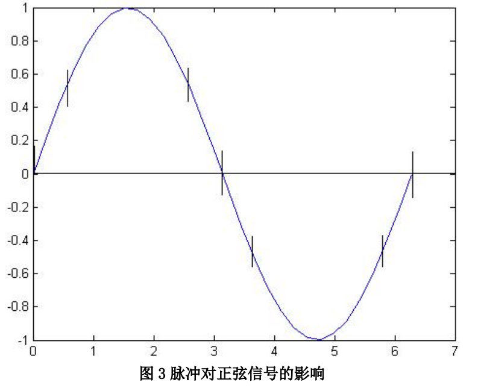

# ADC DAC相关知识

一些性能较好的ADC[9]:

1. AD4630-24
2. LT2500-32
3. AD7177-2
4. AD7175-2
5. AD7190
6. ADS1675
7. ADS1262

疑问：

1. glitch是否引起二次谐波，原理是什么？
2. Dithering 如何提升DAC的性能，如何提升的？

术语：

- FSR: Full Scale Range
- LSB: Least Significant Bit
  - 描述误差（DNL，INL，Gain Error，Offset）时，LSB和FSR之间的转换公式？

## 指标参数

主要参数：精度和速度

- 分辩率（Resolution）
- 转换速率（Conversion Rate）

问：

1. **哪些评价指标是ADC或DAC专有的，哪些指标是ADC和DAC公用的？**
2. **直流应用领域应该关注哪些参数，交流应用呢？**

### 参数分类

直流，交流？频域，时域？

#### 频域

- SFDR: spurious free dynamic range, 无散杂动态范围
  - Dynamic Range什么意思？
- THD: Total harmonic distortion
- SINAD: Signal-to-Noise and Distortion
- ENOB: Effective Number of Bits
- THD + N: Total Harmonic Distortion Plus Noise

#### 时域

- Quantizing Error 量化误差
- Gain Error
- Full Scale Error
- Offset Error
- DNL: Differential nonlinearity, 微分非线性；
- INL: Integral nonlinearity, 积分非线性
  - 非线性，对应：线性度（Linearity）
- delay(or group delay)

瞬态

- Settling time
- glitch(DAC)
- Kickback(ADC)
  - 问：哪些类型的ADC会有kickback, 哪些类型的ADC没有？

噪声

- Noise-Free Resolution
- Effective Resolution

瞬态和噪声参数，姑且算为时域的吧！

具体分析及计算

### SFDR

In ADCs, Spurious-Free Dynamic Range (SFDR) is the ratio of the RMS amplitude of the carrier frequency (maximum signal component) to the RMS value of the next largest noise or harmonic distortion component. SFDR is usually measured in dBc (with respect to the carrier frequency amplitude) or in dBFS (with respect to the ADC's full-scale range). [1]

In DACs, Spurious-Free Dynamic Range (SFDR) is the ratio of the RMS amplitude of the carrier frequency (maximum signal components) to the RMS value of their next largest distortion component. SFDR is usually measured in dBc (with respect to the carrier frequency amplitude) or in dBFS (with respect to the DAC's full-scale range). Depending on the test condition, SFDR is observed within a pre-defined window or to Nyquist.

The worst spur may or may not be a harmonic of the original signal. SFDR is an important specification in communications systems because it represents the smallest value of signal that can be distinguished from a large interfering signal (blocker).

SFDR can be specified with respect to full-scale (dBFS) or with respect to the actual signal amplitude (dBc)[2]. 如下图：

计算公式如下[3]:

SFDR = Fundamental input energy – Max (all frequency bins except fundamental)

### THD

一般是前面5阶谐波对THD影响较大。

THD通常计算到Nyquist频率为止。而超过Nyquist 频率的谐波将会以噪声或杂散（spurious）频率搬移到频谱中，将会在SNR 和 SINAD中体现。计算公式如下[3]:

THD = Summation of harmonic energy / Fundamental input energy

energy，能量，那就是幅度的二次方。

### SINAD

The Signal-to-Noise and Distortion (SINAD) specification provides information regarding the noise and harmonic energy present in the frequency spectrum.

SINAD = Fundamental input energy / (Summation of noise + distortion energy)

### ENOB

要理解有效位数（Effective Number of Bits），可以先理解理想ADC的位数和其量化噪声的关系。

理想ADC量化误差（Quantization Error）如下：

量化误差传递函数及量化噪声计算如下：

图中，q代表LSB，理想的量化误差在$±\dfrac{q}{2}$之间，如果周期为T，那么斜率$s=\dfrac{q}{T}$，那么周期为$T=\dfrac{q}{s}$，误差：

$$E_Q(t)=st \quad (-\frac{q}{2s}   \leq t\leq\frac{q}{2s})$$

对应量化噪声有效值为：

$$
\begin{aligned}
RMS_{QN} &= \frac{1}{T}\sqrt{\int_{-q/2s}^{+q/2s}E_Q^2dt}\\
&= \frac sq\sqrt{\int_{-q/2s}^{+q/2s}\left(st\right)^2dt}\\
&= \frac q{\sqrt{12}}
\end{aligned}
$$

SINAD Signal-to-Noise and Distortion(信纳比)：

$$
\begin{aligned}
SINAD &= 20\mathrm{log}_{10}\frac{RMS_{FS\_SINE}}{RMS_{QN}}\\
&= 20\mathrm{log}_{10}\frac{q2^N/2\sqrt{2}}{q/\sqrt{12}}\\
&= 20\mathrm{log}_{10}2^N+20\mathrm{log}_{10}\sqrt{\frac{3}{2}}\\
&\approx 6.02\times N + 1.76
\end{aligned}
$$

那么反推，对于非理想ADC，其等效有效位数ENOB为：

$$ENOB \approx \dfrac{SINAD - 1.76}{6.02}$$

式中的SINAD是以dB量纲表达的数值。

### Quantizing Error, Gain Error, Full Scale Error and Offset Error

DAC的输出电压线性拟合：

$$V_{out} = AV_{ref}\cdot \frac{Code_{ACT}}{Code_{FS}} + B$$

A为增益拟合系数 A = 1+ Gain Error ，B为Offset Error。

### DNL

定义见下图 [6]:

|DNL|＞1LSB，将会导致输出不单调。If the DNL exceeds 1 LSB, there is a possibility that the converter can become nonmonotonic[6].

### INL

INL是关于非线性的误差，是指失调，增益误差被校正后，实际的传输曲线偏离理想中心线的程度。

也就是说INL是对线性拟合后的残差？如下图 [6]

那是否：

1. **在需要拟合的系统中，INL和DNL会影响残差值，而失调和增益误差则不影响，可以不关注？**
2. **而对于不进行校准的系统中，增益误差和失调可能对输出结果的影响更大？**

解答：

1. 基本是的。Since the offset and gain error can be calibrated out from the ADC transfer curve, the actual error in the application will be dominated by INL and DNL errors [3].

### delay

SAR ADC 的delay时间较短，delta-sigma (ΔΣ) 的延时较长。

对于交流信号而言，group delay越平坦越好。也就是delay时间是恒定值，与交流信号的频率无关，是最好的，此时相位延迟与频率成正比。

### Settling Time

通常衡量settling time的指标为输出稳定到1LSB的时间，不过，对于12位DAC，1LSB代表1/2^12 FS = 0.0244% FS，仍然可以测量，但对于16位的ADC，1LSB代表0.00153% FS，对于测量系统将是一种挑战，尤其是settling time本身就很窄了。 [5]

疑问：为什么Settling Time可以通过系统的settling time 根据下面公式推导？ [5]

$$\text{DAC Settling Time}=\sqrt{\text{(Total Settling Time)}^2-\text{(Op Amp Settling Time)}^2}$$

### glitch

这些过冲与下冲脉冲将会产生 DAC 输出信号的谐波。以正弦波二次谐波的产生为例，如下图所示 DAC 在成形正弦信号时，由过冲与下冲效应引起的脉冲信号数量在一个周期内正好是两次，从而产生了此正弦信号的二次谐波[4].

**但我看不出来，为何？**

另外，如下的解释似乎更准确[5]：

Code-dependent glitches will produce both out-of-band and in-band harmonics when the DAC is reconstructing a digitally generated sinewave as in a Direct Digital Synthesis (DDS) system. For instance, the mid-scale glitch occurs twice during a single cycle of a reconstructed sinewave (at each mid-scale crossing), and will therefore produce a second harmonic of the sinewave, as shown in Figure 4. Note that the higher order harmonics of the sinewave, which also alias back into the Nyquist bandwidth (dc to fc/2), cannot be filtered.

Although segmented DAC architectures can be used to greatly minimize the distortion caused by code-dependent glitches, the distortion can never be completely eliminated.

glitch 产生原因主要分2种：电容性耦合以及开关时序。

电容性耦合产生的glitch（可否认为是一种振铃）影响较小，而开关导致的glitch对信号的影响更大：

Capacitive coupling frequently produces roughly equal positive and negative spikes (sometimes called a doublet glitch) which more or less cancel in the longer term.
The glitch produced by switch timing differences is generally unipolar, much larger, and of greater concern[5].

glitch评估和测量：GLITCH IMPULSE AREA，也就是评估伏秒数，有趣。

### Noise-Free Resolution Bits

无噪声分辨率（好像没有常用的缩写？）[7][8]

判定直流性能的，与交流及频谱相关的额参数不可搞混。

$$
\begin{aligned}
 NFRB = log_2\dfrac{FSR}{Noise_{pp}}
\end{aligned}
$$

另外，有效值噪声分辨率 Effective Resolution （好像也没看到常用缩写）

也是判定直流性能的，与交流及频谱相关的ENOB参数不可搞混。

$$
\begin{aligned}
 ERB = log_2\dfrac{FSR}{Noise_{rms}}
\end{aligned}
$$

Effective resolution and noise-free resolution measure the ADC's noise performance at essentially DC,
where spectral distortion (THD, SFDR) is not factored.

## 参考及引用

[1] What is SFDR? Analog Devices. <https://www.analog.com/en/resources/glossary/sfdr.html#:~:text=In%20ADCs%2C%20Spurious-Free%20Dynamic%20Range%20%28SFDR%29%20is%20the,dBFS%20%28with%20respect%20to%20the%20ADC%27s%20full-scale%20range%29.>
[2] MT-003 TUTORIAL. Understand SINAD, ENOB, SNR, THD, THD + N, and SFDR so You Don't Get Lost in the Noise Floor.
[3] SLAA587-ADC Performance Parameters - Convert the Units Correctly. TI.
[4] ZHCA477-DAC34H84 HD2 性能优化与 PCB 布局建议. TI.
[5] MT-013 TUTORIAL. Evaluating High Speed DAC Performance. by Walt Kester. Analog Devices.
[6] SLAA013 Understanding Data Converters. TI.
[7] AN5384 Understanding Noise, ENOB, and Effective Resolution in Analog-to-Digital Converters. maximum (ADI).
[8] ADC的ENOB(有效位数)计算公式的推导，以及其他相关参数的介绍. <https://blog.csdn.net/cusichidouren/article/details/131356209>
[9] How to Achieve 7.5-Digit Accuracy in Instrumentation Applications: Part 1. <https://www.analog.com/en/resources/technical-articles/achieve-7-pt-5-digits-accuracy-instrumentation-apps-part1.html>
