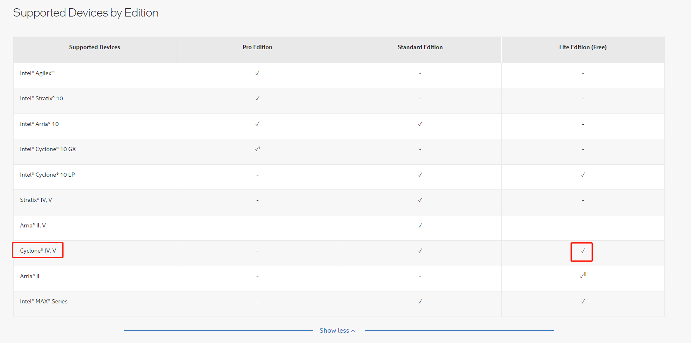

# Intel-FPGA开发工具

[Intel® Quartus® Prime Software](https://www.intel.com/content/www/us/en/products/details/fpga/development-tools/quartus-prime/article.html)

看起来，开发Cyclone IV E系列，EP4CE6 ~ EP4CE115，用免费的lite版本就够了。

Intel Quartus Prime Lite Edition Design Software<https://www.intel.com/content/www/us/en/software-kit/757262/intel-quartus-prime-lite-edition-design-software-version-22-1-for-windows.html?>

该软件已经集成了仿真工具 [Questa*-Intel® FPGA Edition Software](https://www.intel.com/content/www/us/en/software/programmable/quartus-prime/questa-edition.html)

且已经集成了[Intel® High Level Synthesis Compiler](https://www.intel.com/content/www/us/en/software/programmable/quartus-prime/hls-compiler.html)，可以用高层综合进行开发。

## 参考及引用
