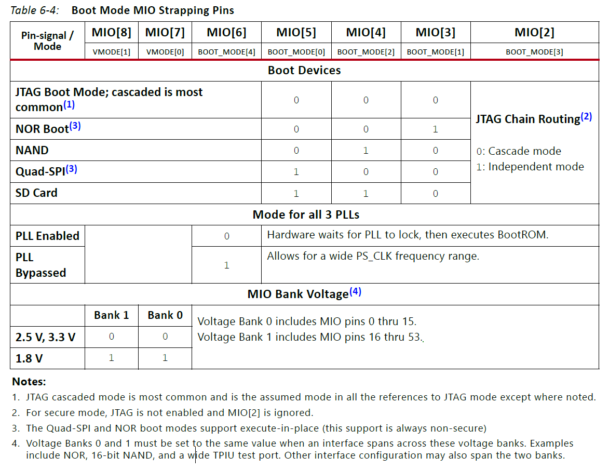
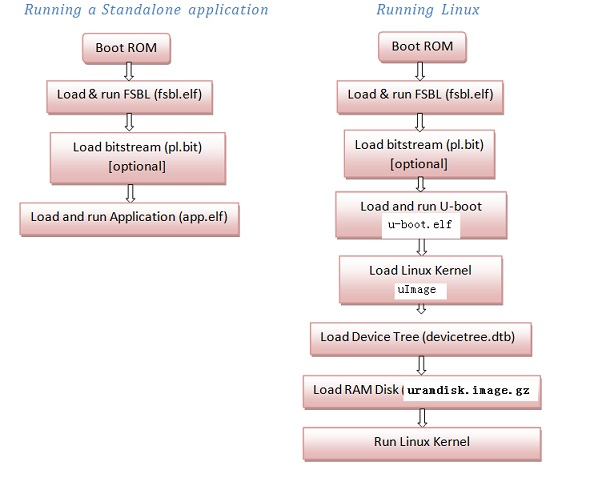
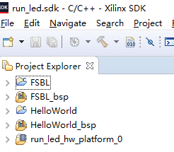
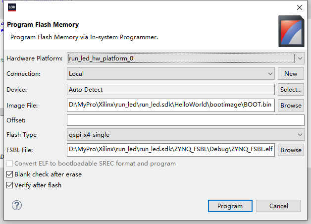

# Xilinx-程序固化

FPGA一般在仿真和烧录的时候，都是烧录到易失性存储介质里面，掉电重启后，就需要重新烧录程序。但有时候需要固化程序，这个时候，就可以将文件烧录到非易失性存储介质里，比如Flash，SD卡等。

下面的程序固化方案是ZYNQ7000板子，运行PL以及PS（无系统，裸跑）的程序固化方案。

## 启动方式配置

ZYNQ7000 SOC可以从Flash启动，也可以从SD卡启动。因此，可以将启动镜像文件写入SD卡或者Flash。然后配置启动方式为对应的介质。

根据Xilinx 的文档 **ug585-Zynq-7000 SoC Technical Reference Manual**，需要配置MIO[8]-MIO[2]，以配置启动选项，如JTAG，NAND，NOR，QSPI，SD卡，见下图：

<div  align="center">

</div>

上电之前，需要配置好启动的方式，米联客开发板中，使用拨码开关进行启动方式的配置。

## 镜像文件生成

### 镜像文件需要包含哪些东西

- PL 部分需要的bit文件
- PS 部分需要的elf文件
- FSBL.elf 文件 （FSBL：first stage boot loader），该文件由SDK生成
- 打包生成BOOT.bin

其中，PL与PS部分需要的bit和elf文件在建立对应的PL和PS项目时，已经生成了，同时，其作用也比较明显，但FSBL.elf 又有什么用？

在zynq上运行程序的时候，加载过程中肯定需要用到一个文件，那就是 FSBL ， FSBL 的全称为first stage boot loader，从字面上就能够看出这是zynq启动第一阶段的加载程序，经过了fsbl这一阶段，后面系统才能够运行裸奔程序或者是引导操作系统的u-boot。启动过程如下图：<sup>[1]</sup>：

<div  align="center">

</div>

也可以在SDK中，新建 FSBL 项目时，看其简介：

First Stage Bootloader (FSBL) for Zynq. The FSBL configures the FPGA with HW bit stream (if it exists)  and loads the Operating System (OS) Image or Standalone (SA) Image or 2nd Stage Boot Loader image from the  non-volatile memory (NAND/NOR/QSPI) to RAM (DDR) and starts executing it.  It supports multiple partitions,  and each partition can be a code image or a bit stream.

疑问：如果正常用 JTAG 连接，为什么不需要 FSBL ？

### FSBL.elf如何生成

可以看出，FSBL.elf也是一种elf文件，也是运行在PS中的，那么其实他的生成方式也是和 *PROJECT.elf* 基本一样的；

在18版本的，file --> new --> Application Project --> 写入Project Name，确认其他信息 --> 点击 next -- 选择模板：Zynq FSBL --> 点击finish

疑问：

- 为什么在SDK建立HelloWorld程序时，会附带一个HelloWorld_bsp，同样，建立一个FSBL项目时会附带一个FSBL_bsp项目？
- bsp什么意思？答：BSP: Board Support Package，板支持包；
- 为什么我们项目中本来就有一个独立的项目：platform平台了，还要一个板支持包？

<div  align="center">

</div>

### BOOT.bin 文件如何生成

右键单击项目，选择 Create Boot Image, 就能生成BOOT.bin文件了。

## 写入SD卡并启动

SD卡需要格式化成FAT32，然后将BOOT.bin复制到SD卡根目录。再将SD卡插入FPGA板子，上电即可。  
PS：上电前需要将bootmode配置成SD卡模式。

## 写入Flash并启动

上面的bin文件可以直接复制到SD卡，但是，不能直接复制到Flash，复制到Flash的话，需要多一个FSBL文件（跟上面那个有区别）。  
如下描述引用自：[ZYNQ flash在QSPI模式下不能下载，下载后不能正常运行](https://blog.csdn.net/qq_35731651/article/details/116269990)

```txt
在AR# 70548文档介绍：烧写FLSASH尽管强烈推荐使用JTAG引导模式，但是对于以QSPI模式启动的设备有一个解决方案：
新建在FSBL工程（新建，和之前用来生成BOOT.BIN用的fsbl.elf不是同一个）mian.c文件中main函数383行后面增加BootModeRegister = JTAG_MODE; （位置不要放错，其他函数也有类似的位置）。编译成又一个FSBL_Loader.elf文件。这个是用来下载的，之前那个是用来合成BOOT.BIN的。
```

根据个人理解，上面这篇文章说的FSBL_Loader.elf文件，是在JTAG烧录的时候运行的，就是JTAG先将FSBL_Loader.elf推给PS系统，PS执行FSBL_Loader.elf，因为里面的启动模式配置为JTAG（BootModeRegister = JTAG_MODE;），因此，继续从JTAG获取BOOT.bin，并将其烧录到Flash中。所以，FSBL_Loader.elf 应该只是为了和JTAG通信用并将BOOT.bin写入Flash用的，本身并不会写入Flash。

烧录选项见下图：

<div  align="center">

</div>

断电重启后，因为拨码开关已经配置到了QSPI Flash，所以PS系统会直接从Flash启动，运行BOOT.bin里面的文件。而这个BOOT.bin是和SD卡中的一模一样的，不需要配置**BootModeRegister = JTAG_MODE;**

## 参考及引用

[1] Zynq-Linux移植学习笔记之四-fsbl. CSDN. <https://blog.csdn.net/zhaoxinfan/article/details/54958641>
