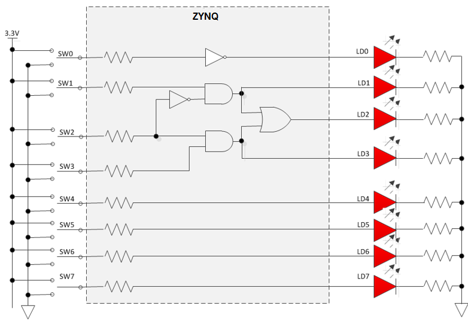
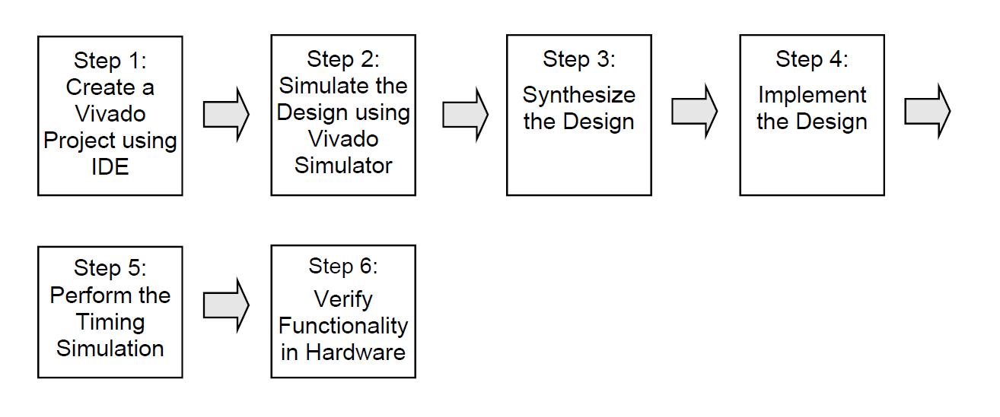

# vivado 设计流程

**点亮LED灯——一灯大师的必经之路**

本文主要Lab Workbook. Vivado Design Flow.  

本章学习内容：

1. 新建工程，设置FPGA型号，添加HDL文件（verilog）；
2. 添加现成的约束文件（xdc）分配芯片引脚；
3. 仿真（用 Vivado simulator）；
4. 综合（synthesis）以及执行（implement）；
5. 生成bitstream（烧录文件）；
6. 将bitstream文件烧录并验证功能。

疑问：vivado 中 implementation（实现）是何意？  

implementation，主要包含两步，placement，布局，把综合后的基本单元放到器件的各个位置；routing，布线，也就是把各个单元连接起来；一般还加一步physical synthesis，主要是为了优化后端时序[1]。

项目的完整的设计如下：

如图，SW0 ~ SW7为开关，LD0 ~ LD7为发光二极管(LED)，然后设计简单的逻辑，用开关控制LED 的发光状态。

设计流程如下：

## 新建项目

file -> new project

可以添加约束文件和设计文件，不过我选择不添加，等进入工程后再慢慢添加。

选择硬件，zedboard使用的是：xc7z020clg484-1（也可以直接选择zedboard）。

### 添加设计文件

新建或者打开项目后，会有source窗口，里面有Design Sources栏目，右键新建，根据提示，选择并新建自己要的文件就是了。

### 添加约束文件

同样在source窗口，里面有Constraints栏目，右键新建就行。

### 添加仿真文件

也是在source窗口，里面有 Simulation Sources 栏目，右键新建就行。

### vivado界面

## 仿真

设置及仿真步骤：

1. 添加仿真文件（根据上一节的方法）；
2. 设置仿真时间
   1. 在flow navigator窗口中，点击Project manager -> settings；
   2. 选择simulation；
   3. 找到xsim.simulate.runtime*，将其这只成200ns；
3. 在flow navigator窗口中，点击SIMULATION -> Run Simulation -> behavior simulation;

然后就可以查看仿真结果了。  

另外，综合后功能仿真和综合后时序仿真，此处未讲。

## 综合（Synthesize）

## 实现（Implement）

## 时许仿真

## 生成比特流文件并下载验证

## 参考及引用

[1] vivado中symthsis（综合）和implementation（执行）具体是为了完成什么操作？ 知乎 <https://www.zhihu.com/question/304719093>
