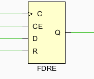

# xilinx FPGA 常识

FDRE: 代表一个单D型触发器，含的有五个信号分别为：  数据（data,D）、时钟使能（Clock enable,CE）、时钟（Clock）、同步复位（synchronous reset，R）、数据输出（dataout,Q）。当输入的同步复位信号为高时，否决（override）所有输入，并在时钟的上升沿将输出Q为低信号。在时钟的上升沿数据被加载进入D触发器的输入[1]。

## 参考及引用

[1] Xilinx源语-------FDRE. <https://www.cnblogs.com/luxinshuo/p/11913988.html>
