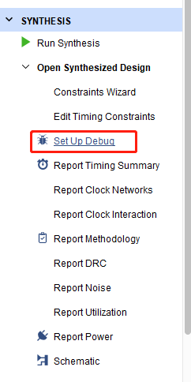
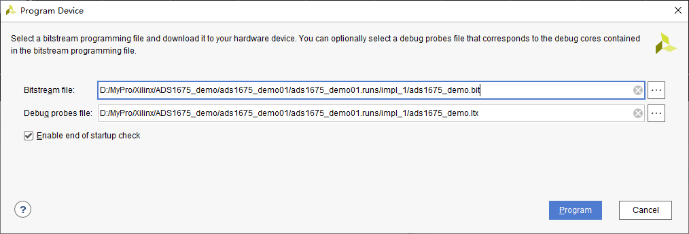

# Xilinx-FPGA在线调试的办法

FPGA的debug也是FPGA设计中重要的一环。掌握并灵活运用FPGA设计工具的debug功能也是加快FPGA设计的关键[1]。

## 在线调试观察数据

看起来基本上都是使用自带的ILA核（Integrated Logic Analyzer）实现在线调试观察运行状态，不过，调用方法却又数种：

1. 直接在IP catalog 生成IP核，将IP核例化后，生成的bit文件就会有调试器（*.ltx文件，烧录bit流时，也要烧录）；
2. 在约束文件（*.xdc）中，将需要调试观察的net标记为`MARK_DEBUG`，如`set_property MARK_DEBUG false [get_nets {C0_reg_n_0_[4]}]`;
3. 在verilog源码中，标记net为`MARK_DEBUG`，如：`(* MARK_DEBUG="true" *) wire data_sclk;`；
4. 在综合后的原理图（Schematic）文件中，将需要调试的net，用鼠标右键标记为`mark debug`，这种方法会自动在约束文件中标记。

如上2、3、4方法需要使用set up Debug进行配置。见下图：

生成bits文件和调试探针文件后，烧录时，会有探针文件的选项，烧录后会自然弹出ILA调试窗口。

烧录文件选择：

不过，这个设置有太多的限制，比如：

1. 输入时钟频率太高时，不能满足时序要求，不产生调试探针文件；
2. 数据深度太大（比如选择65536时），不能选择触发条件（触发条件总是默认always），且不知为何会这样。

## 调试时输入变量或者常量

使用VIO核（Virtual Input/Output core）

## 参考及引用

[1] Xilinx Vivado 硬件诊断（ ila和vio的使用） <http://xilinx.eetrend.com/content/2018/100013006.html>
