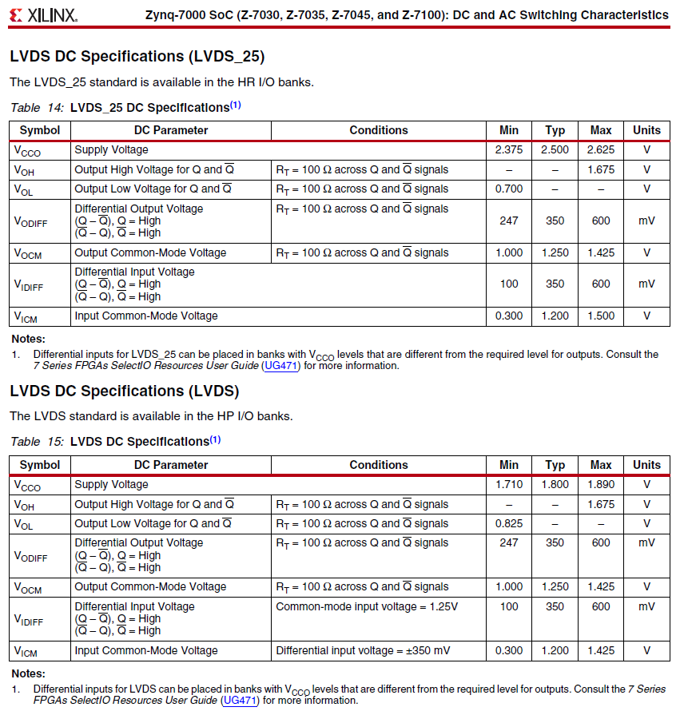
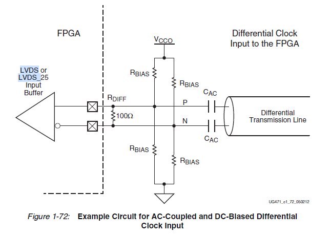
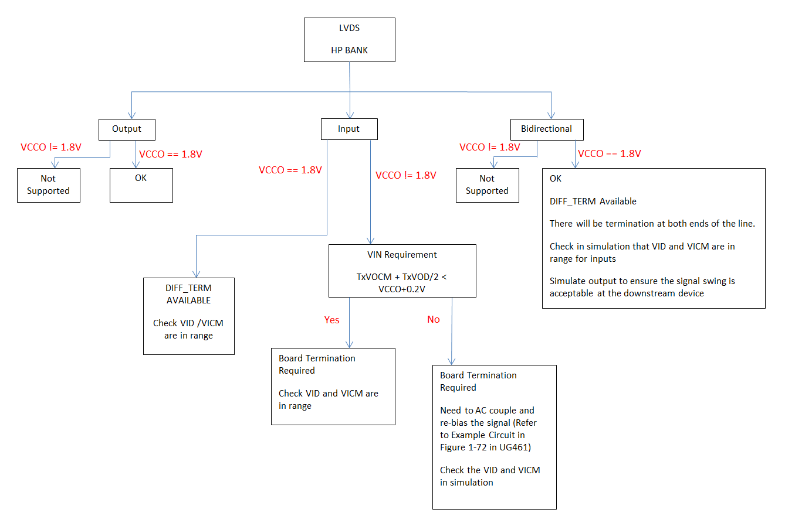
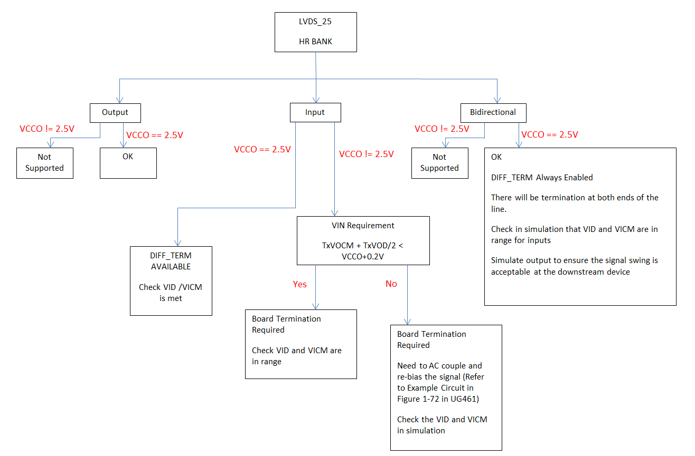

# Xilinx-LVDS接口

LVDS: Low-voltage differential signaling, also known as TIA/EIA-644[1].

电平标准：

| Vee  | VOL   | VOH  | Vcc       | VCMO |
| :--- | :---- | :--- | :-------- | :--- |
| GND  | 1.0 V | 1.4V | 2.5–3.3 V | 1.2V |

从上表中可以看出，差模电压为：$${VDIFF = VOH - VOL = 0.4V}$$

在Xilinx FPGA 中，LVDS接口的电平为[2]:

也就是说，在Zynq 7芯片中，不论是LVDS_25还是LVDS，其输入、输出电平都是兼容标准的LVDS的，同时，其输入电压兼容范围非常广：1、差模 100mV < VIDIFF < 600mV；2、共模 300mV < VICM < 1.425mV。

## VCCO 供电电压及兼容性

上面说到，Zynq 7支持LVDS_25和LVDS，但这两个不论是输入还是输出电平，都是一样的，兼容标准的LVDS，其区别只是IO口供电电压VCCO。

1. 在HR I/O banks接口中，VCCO必须输入额定电压2.5V（2.375V-2.625V），同时将IO配置为LVDS_25;
2. 在HP I/O banks接口中，VCCO必须输入额定电压1.8V（1.710V-1.890V），同时将IO配置为LVDS。

但是，也有例外情况，那就是当接口仅作为输入口的时候，VCCO不一定要是额定电压。

根据UG471[3]，有：

It is acceptable to have differential inputs such as LVDS and LVDS_25 in I/O banks that are powered at voltage levels other than the nominal voltages required for the outputs of those standards (1.8V for LVDS outputs, and 2.5V for LVDS_25 outputs). However, these criteria must be met:

1. The optional internal differential termination is not used (DIFF_TERM = FALSE, which is the default value). 也就是不使用内部端接电阻；
2. The differential signals at the input pins meet the VIN requirements in the Recommended Operating Conditions table of the specific device family data sheet. 差分信号满足Vin要求。
3. The differential signals at the input pins meet the VIDIFF (min) requirements in the corresponding LVDS or LVDS_25 DC specifications tables of the specific device family data sheet.差分电压满足最小输入差分电压VIDIFF (min)要求；
4. For HR I/O banks in bidirectional configuration, internal differential termination is always used. 为何这里又强调在HR I/O中，配置为双向模式时，一定要使用内部端接电阻（与第一点冲突）。

为了满足上述要求，可以使用如下图的接线方法。

### LVDS Interface Checklist

根据Xinlix官网上的问答[4]，有：

HP IO:

HR IO:

根据图中的公式，其重点就是，引脚输入电压最高不得超过VCCO+0.2V，也就是：Vin = Vcm + VD/2 < VCCO +0.2V。

PS：一般芯片标称输入IO的绝对最大电压不得超过Vcc+0.3V，但有些芯片会同时标明，若是超过Vcc+0.3V，需要有限流，比如10mA以内，这是因为IO内部有二极管接到Vcc作为保护，二极管不烧坏就可。

## 参考及引用

[1] Low-voltage differential signaling. Wikipedia. <https://en.wikipedia.org/wiki/Low-voltage_differential_signaling>
[2] ds191-Zynq-7000 SoC DC and AC Switching Characteristics.pdf
[3] ug471_7Series_SelectIO.pdf
[4] 7 Series, UltraScale, UltraScale+ FPGAs and MPSoC devices - LVDS_33, LVDS_25, LVDS_18, LVDS inputs and outputs for High Range (HR) and High Performance (HP) I/O banks. <https://www.xilinx.com/support/answers/43989.html>
