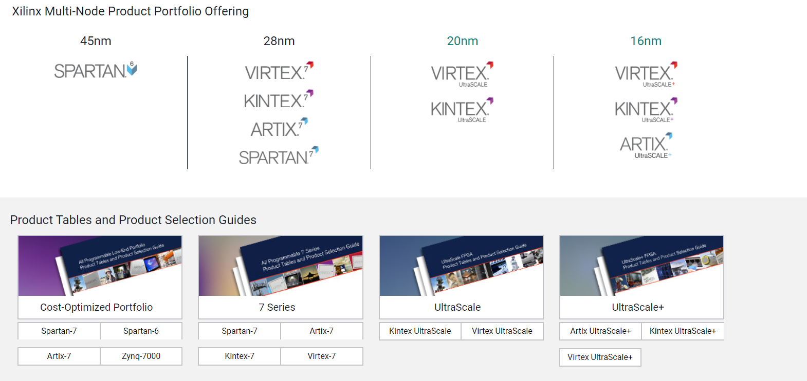
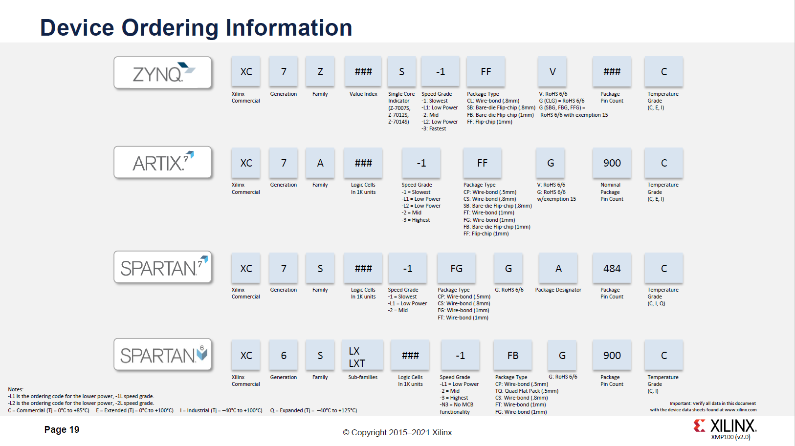

# Xilinx芯片系列

FPGA按照产品系列分为[1][2]：

SPARTAN6，SPARTAN7，Artix, Artix UltraScale+TM, Zynq和Zynq UltraScale+TM等系列。

还有属于CPLD的CoolRunner-II系列。

如下图：

## 命名规则

也就是供应商规格，见下图：

## 参考及引用

[1] FPGA Leadership across Multiple Process Nodes. Xilinx <https://www.xilinx.com/products/silicon-devices/fpga.html>
[2] 5分钟了解FPGA之Xilinx 7系列. 电子创新网赛灵思社区 <http://xilinx.eetrend.com/content/2019/100042384.html>
