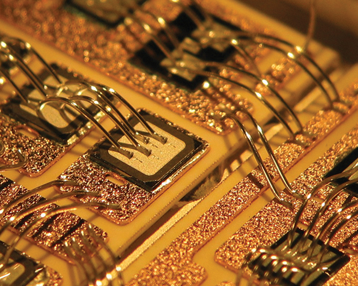
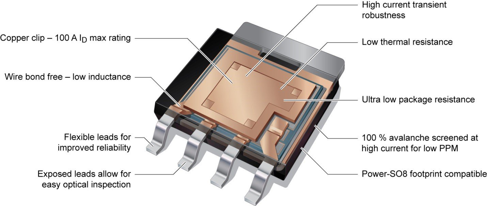

# bonding方式

绑定有很多种，如下是wire bonding 和clip bonding 的图示：

wire bonding

clip bonding

<https://en.wikipedia.org/wiki/Wire_bonding>
<https://zh.wikipedia.org/wiki/%E6%89%93%E7%B7%9A%E6%8E%A5%E5%90%88>
