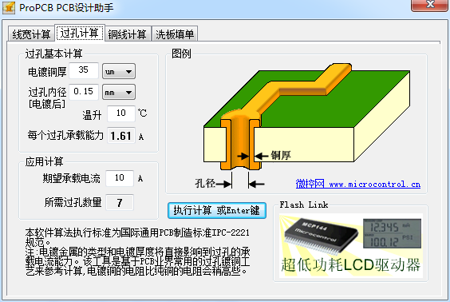

# PCB走线宽度

## 基础知识[1]

PCB铜箔厚度:

PCB铜箔的厚度是以OZ为单位，1OZ意思是重量1OZ的铜均匀平铺在1平方英尺（$$FT^{2}$$）的面积上所达到的厚度，1OZ=35um=0.035mm。  
一般PCB铜厚有三个尺寸，0.5OZ、1OZ和2OZ。  
我们常用的多层板，一般表层铜厚为1OZ，内层铜厚为0.5OZ。  
大电流的电源PCB，可以考虑2OZ甚至更厚的铜箔（更大电流还可以使用镀锡铜条来降低电阻）。

电阻率：

散热：

- 外层走线散热效果较好，内层散热较差
- 敷铜开窗可以改善散热（热传导，对流换热系数较高？）

## 推荐工具

- ProPCB-PCB设计助手
    

    
    

- ANSI-PCB走线宽度计算器
    

    
    

Todolist:

1. 根据国际通用计算公式，写一个计算工具(根据章节6.2和图6.4[2])
2. 作曲线图（二维或三维的都可）

参考及引用：

[1] PCB上10A的电流需要走多宽的线？需要几个过孔？ <https://mp.weixin.qq.com/s/DEmvAVH6ol1nqzv0Fw_MUA>
[2] 《IPC-2221A》-PCB设计通用标准-中文版
