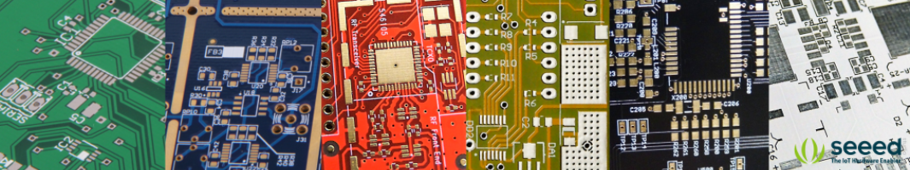

# 为什么常见的PCB是绿色的

个人认为：

- 主要是绿色对眼睛友好，检查PCB实际电路时，绿色最容易看出来。其他颜色很难看出，而且眼睛很疲劳。
- 然后绿色就变成主流，交齐，成本都有优势，除非装13，否者还是直接无脑选绿色就是了。

如下是简书原文[1]:

电路板其实就是一块铜片，外面包裹一层树脂。这层树脂外壳又称为阻焊膜，是一种带有彩色颜料的硬化树脂，以丝网印刷的方式涂在铜板上。它的目的是保护下面的电子线路免受潮湿和灰尘的影响，并控制焊料的流动。

这层树脂可以有多种颜色，如蓝色，红色，黄色，黑色和白色，但是通常情况下，它是绿色，这是为什么？

早期，电路板是否印刷正确，依赖于工人的裸眼检查。整天看这么微小的电路，非常伤视力。绿色最有利于减轻视觉疲劳。此外，人眼或视锥细胞对绿光非常敏感。绿色电路板的视觉对比度更大，而对比度越高，错误越容易发现。绿色电路板往往肉眼就可以轻松识别电路的缺陷。

另外，绿色电路板也有更好的性能。目前，绿色阻焊膜是唯一可以可靠地生产 0.1毫米（4mil）焊接掩模坝的颜色。接下来是红色，黄色和蓝色，可以产生0.12毫米，然后才是黑色和白色，只能达到0.15毫米。焊接掩模坝在防止焊桥形成方面很有价值。

最后，绿色是历史上默认的电路板颜色，所有厂家都支持，所以批量生产绿色电路板的成本是最低的。

参考及引用：

[1] 为什么电路板大多是绿色的？ <https://www.jianshu.com/p/7a56ac748dcb>
[2] Why Are Printed Circuit Boards Usually Green In Color? <http://www.seeedstudio.com/blog/2017/07/23/why-are-printed-circuit-boards-are-usually-green-in-colour/>
