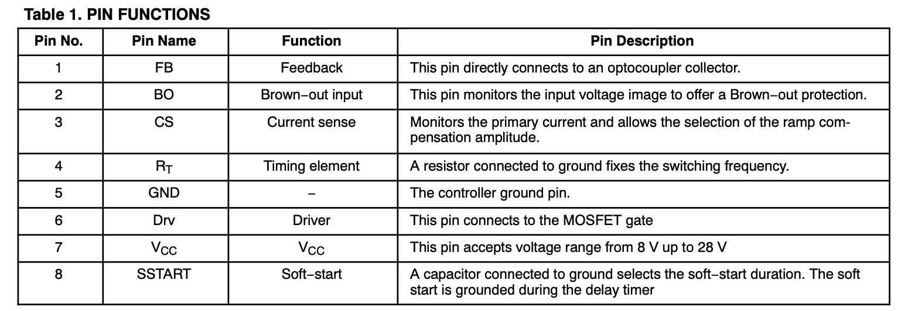

# NCP1252解读

## 特点

- Peak Current Mode Control-电流模式
- Jittering Frequency ±5% of the Switching Frequency-抖频
- Latched Primary Over Current Protection with 10 ms Fixed Delay-保护锁死
- Adjustable Soft−start Timer-软起过程可控
- 160ns LEB
- Adjustable Internal Ramp Compensation-内部补偿
- +500 mA / –800 mA Source / Sink Capability-驱动能力不算大
- A-B-C-（D-E）版本的最大占空比：50%-80%-65%-（47.5%-47.5%）

适用拓扑：正激和反激。

应用电路拓扑

## 引脚功能说明

| 引脚 |   名字   |                                             功能 |
| ---- | :------: | -----------------------------------------------: |
| 1    |   反馈   |                                       接反馈光耦 |
| 2    | 电压采样 | 原边开关管电压，输入电压，用于启动和输入欠压保护 |
| 3    | 电流采样 |                       用于斜率补偿，以及过流保护 |
| 4    | 时间常数 |                                     设置开关频率 |
| 5    |   GND    |                                                - |
| 6    |   驱动   |                                                - |
| 7    |   Vcc    |                                                - |
| 8    |  软启动  |                             用电容设置软启动时间 |

## 内部电路功能拓扑

这里我从左边的FB引脚开始分析：  
1、FB引脚：

- 内部有一上拉电阻，外部接入光耦C极，电源输出电压高，光耦电流增加，FB引脚电压变低，因此控制占空比降低，也就是降低输出，形成负反馈；
- 输入有一个二极管，然后再分压成1/3VFB给运放，控制占空比。这里二极管很重要，因为光耦的C极很难达到或者接近0V，假如说输出光电三极管饱和时的CE最低只能达到0.2V，那么简单的运放电路就不容易将PWM控制到0%附近的占空比，这在轻载和空载模式下，是非常致命的，会导致输出电压飘高。而且，在CE接近饱和的时候，光耦输入输出电流比例可能变得非常低（LED电流增大，但光电三极管已经饱和，电流增加会非常微弱），环路增益变得很小，这也不利于控制。上述二极管的存在解决了该问题，也就是当光耦输出电流接近饱和之前（C极0.5V-0.6V左右？），就将FB实际采样电压（运放的N输入端，用于控制PWM）调整到0V，然后再跟随C极电压增加而线性增加采样电压；
- Vskip用于轻载和空载时的打嗝模式，节电；

2、CS引脚：

- Rcomp：先说补偿的结果——电流保护点并不是固定不变的，而是随输入电压有一定范围的调节，使得过流保护时的输出功率不随输入电压有明显的差异（如果是固定的电流保护点，那么很明显，最大原边电流一定，输入电压越小，输出功率越小）。但具体的量化公式呢？
- LEB：leading edge blanking，前沿消隐，PWM打开瞬间，不检查，因为寄生电容导致的电流冲击很可能误触发过流保护；
- CS供给三个运放输入，从上到下，依次是：a）、与VFB比较，控制占空比；b）与1V基准电源做比较，做过流保护，单次触发过流，关闭驱动，限制占空比，连续触发过流，计时并关闭且锁机；c）软启动，与SS引脚比较电压，根据VSS，限制CS电流；
- 过流保护逻辑：单次触发时，立刻关闭PWM，限制占空比，从而达到限制峰值电流的目的；连续触发时，达到105s后（E版本为150ms，可是什么场合需要那么长的时间呢？），关闭芯片，等待断电重启。

3、BO引脚：

- 输入欠压保护引脚，电压$$V_{BO} > V_{BO-ref}$$时开机，电压$$V_{BO} < V_{BO-ref}$$时关机。
- **重点：使用电流做回差**，开机之前，会有一个恒流源$$I_{BO-hyst}$$拉低BO脚的电压，一旦开机，恒流源关闭，不再拉BO脚电压，BO脚电压会有一定的回升，确保$$V_{BO}$$在开机时不会再次低于$$V_{BO-ref}$$，芯片保持正常启动。因此，我们可以通过分压电阻的阻值和比例，设置不同的开关机电压（包括回差范围），比如输入电压在370V时开机，330V时关机。
- **有一个bug**：$$BO$$引脚的滤波电容不能太大。若是滤波电容太大，在芯片开机时，也就是恒流源$$I_{BO-hyst}$$刚刚关闭不久，$$V_{BO} \approx V_{BO-ref}$$，$$BO$$引脚容易触发保护（之前在L6599芯片上，用1uF时，开机触发过保护，用0.1uF的就不会）。
- 回差电流：$$I_{BO-hyst} = 10uA$$

4、SS（Soft−start）引脚：

- 用于软启动，外部需要加电容$$C_{ss}$$。
- 在开机时内部恒流源$$I_{ss}=10uA$$给$$C_{ss}$$电容充电，电容越大，充电时间越长，启动过程时间越长（体现在输出上升过程越平缓）。
- 从框图上看，$$V_{ss}$$和$$V_{FB}$$具有或的关系，他们的反馈权重是一样的，开机时，$$V_{ss}$$的电压较小，PWM发生器模块首先被$$V_{ss}$$触发而限制占空比$$D$$，此时FB的功能仍然处于开环状态，PWM随着$$C_{ss}$$充电升高电压而增加占空比$$D$$。
- 当$$C_{ss}$$充电到某个程度（接近饱和时），这个时候$$V_{ss} < V_{FB}$$，那么软启动过程完成，SS引脚的反馈处于开关状态，PWM的占空比将由$$V_{FB}$$决定。
- 如果$$V_{ss} > V_{OC}$$  以及 $$ V_{FB} > V_{OC}$$，这里$$V_{OC} = 1V $$是过流保护触发电压，也就是，软启动过程结束，但FB反馈引脚仍然没有建立反馈（也许光耦已经开始下拉电流了，但$$V_{FB}$$仍然高于$$V_{OC}$$过流保护逻辑仍然触发了）。

5、GND引脚：

- NAN

6、Drv引脚：

- 驱动，推挽拓扑。

7、Vcc引脚：

- 内部稳压二极管30V；
- 推挽驱动电路钳位：15V；
- **非常坑爹**：A, B, C versions的开机电压时10V，而D & E versions的开机电压时14V；
- **更加坑爹**：Vcc从启动电压到欠压保护的回差（Hysteresis between VCC(on) and VCC(min)），A, B, C versions为1.0V，D & E versions为5.0V

8、RT引脚：

- 时间常数设置引脚，用一个下拉电阻来设置内部频率发生器的频率；
- 抖频功能是做在内部频率发生器里的，不需要外部调节，也就是不可调节。

## 一些简单的计算

2020年11月08日——我懒了，这些留到下次有使用该芯片的时候再计算吧！这次只是调研，且计划不使用，就不做详细计算了。

1、$$BO$$脚设置回差电压，计算分压电阻

2、过流保护点设置

3、RT引脚设置频率

4、软启动时间设置
