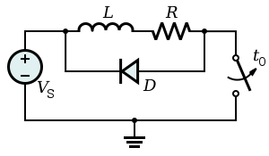
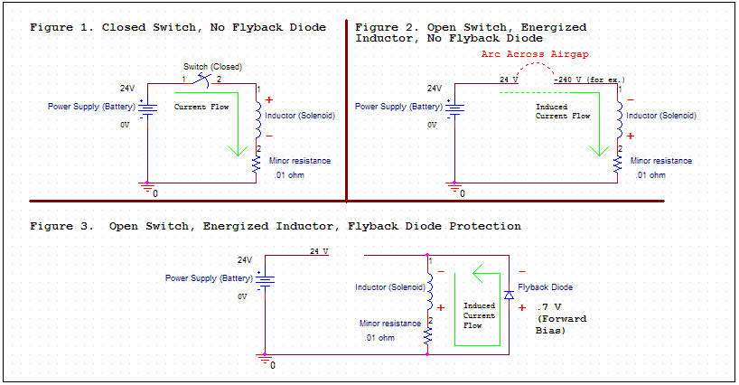

# 续流二极管

什么是续流二极管？

看网络上的解释：

1. 续流二极管（flyback diode），有时也称为**飞轮二极管（freewheeling diode）**或是**snubber二极管**，是一种配合电感性负载使用的二极管，当电感性负载的电流有突然的变化或减少时，电感二端会产生突波电压，可能会破坏其他元件。配合续流二极管时，其电流可以较平缓的变化，避免突波电压的发生[1]。
2. This diode (**Flyback diode**) is known by **many other names**, such as **snubber diode**, **commutating diode**, **freewheeling diode**, **suppressor diode**, **clamp diode**, or **catch diode**[2].
3. **Definition**: Freewheeling diode is used to protect the circuit from unusual damage caused due to abrupt reduction in the current flowing through the circuit. It is also known as **Flyback diode** and forms connection across the inductor to remove Flyback voltage generated across it[3].

简单的应用电路如下面图形所示[2]：

## 参考及引用

[1] 续流二极管. 维基百科. <https://zh.wikipedia.org/wiki/%E7%BB%AD%E6%B5%81%E4%BA%8C%E6%9E%81%E7%AE%A1>
[2] Flyback diode. Wikepedia. <https://en.wikipedia.org/wiki/Flyback_diode>
[3] Freewheeling (Flyback) Diode. <https://electronicscoach.com/freewheeling-diode.html>
