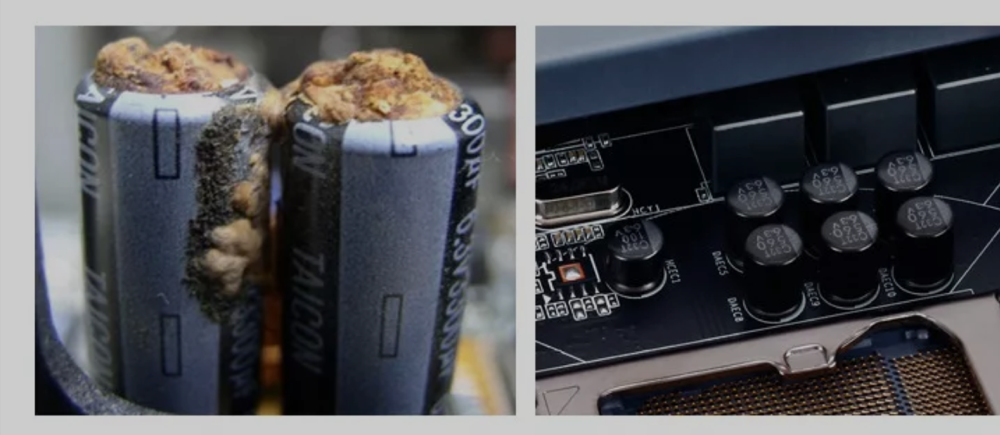

# 电容-电解电容-固态和液态

固态点解电容相比普通液态电解电容：

## 区别

液态：

- 酸性液体作为电介质，电解基板为铝（有疑问，电解质具体是什么酸，正极和负极又是什么，和电池什么区别）？
- 外壳接负极，因此一般都会再加一层绝缘塑料套

固态：

- 高分子电介质材料（什么高分子？）
- 一般金属外壳直接裸露

外形：

见下图，作为液态电解电容（爆浆后），右为固态电解电容：

比较简单的辨别方式是，液态电解电容有防爆阀，一般是“K”或“十”字的，见下图（十字的）：

## 优缺点

| 项目           | 液态                 | 固态              |
| :------------- | :------------------- | :---------------- |
| ESR            | 较大                 | 很小              |
| 高温105度寿命  | 很短2000小时         | 很短2000小时      |
| 普通温度下寿命 | 较短                 | 很长（23年@70度） |
| 耐压           | 500V（较高）         | 50V（较低）       |
| 体积容量       | 较高                 | 较低              |
| 频率响应       | 低频（音频）比固态好 | 100k-10MHz更出色  |
| 危险性         | 易爆浆               | 几乎不可能爆浆    |
| 低温特性       | 容值下降且ESR骤升    | 容值和ESR都较稳定 |

另外，同意文章[1]作者的一个观点：虽然理论上固态电容的寿命很高，但是在实际使用过程中仍然会出现很多故障。

我不知道作者这样说的具体含义，但就个人而言，液态可能比不上固态的寿命，但至少早期使用上，液态电解在理论寿命到达前，并不容易出故障，但是，固态的好像就比较容易在早期的测试和使用中出现故障，**难道是工艺的问题**？

参考及引用

[1] 谈谈固态电容的“利”与“弊”！ <https://mp.weixin.qq.com/s/DaOFH5jI5DlwHNvskab8vQ>
