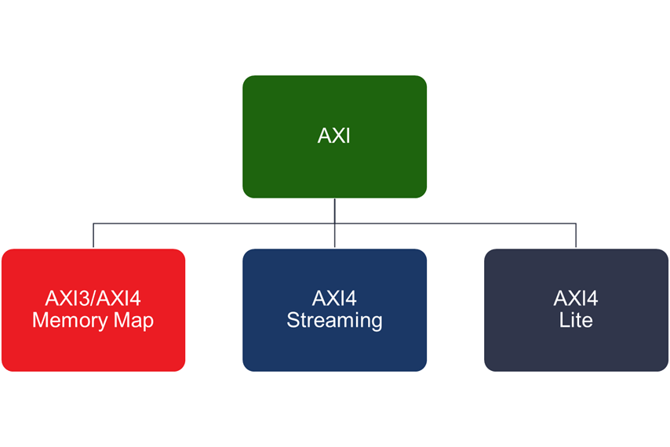
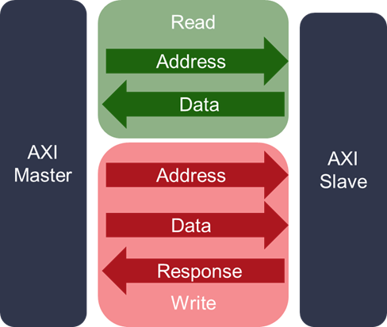

# AXI接口及xilinx-AXI接口

AXI: Advanced eXtensible Interface, part of the [ARM Advanced Microcontroller Bus Architecture](https://en.wikipedia.org/wiki/Advanced_Microcontroller_Bus_Architecture) 3 (AXI3) and 4 (AXI4) specifications, is a parallel high-performance, synchronous, high-frequency, multi-master, multi-slave communication interface, mainly designed for on-chip communication [1].

AXI 都有哪些标准，见下图 [2]

## AXI Read and Write Channels

见下图：

The AXI protocol defines 5 channels:

- 2 are used for Read transactions
  - read address
  - read data
  - 3 are used for Write transactions
- write address
  - write data
  - write response

## xilinx AXI接口

参考：

[AXI接口协议详解-AXI总线、接口、协议](http://xilinx.eetrend.com/blog/2020/100052459.html)  
[Xilinx FPGA AXI4总线实例介绍（二）：5 个读写通道](http://xilinx.eetrend.com/blog/2021/100063318.html)

## note

### AMBA

AMBA: The ARM Advanced Microcontroller Bus Architecture.

The ARM Advanced Microcontroller Bus Architecture (AMBA) is an open-standard, on-chip interconnect specification for the connection and management of functional blocks in system-on-a-chip (SoC) designs. It facilitates development of multi-processor designs with large numbers of controllers and components with a bus architecture. Since its inception, the scope of AMBA has, despite its name, gone far beyond microcontroller devices. Today, AMBA is widely used on a range of ASIC and SoC parts including applications processors used in modern portable mobile devices like smartphones. AMBA is a registered trademark of ARM Ltd. [3]

1. AXI Coherency Extensions (ACE and ACE-Lite)  
  ACE, defined as part of the AMBA 4 specification, extends AXI with additional signalling introducing system wide coherency. This system coherency allows multiple processors to share memory and enables technology like ARM's big.LITTLE processing. The ACE-Lite protocol enables one-way coherency, also known as I/O coherency; for example, a network interface that can read from the caches of a fully coherent ACE processor.
2. Advanced eXtensible Interface (AXI)  
3. Advanced High-performance Bus (AHB)  
  AHB is a bus protocol introduced in Advanced Microcontroller Bus Architecture version 2 published by ARM Ltd company. In addition to previous release, it has the following features: large bus-widths (64/128/256/512/1024 bit).
  A simple transaction on the AHB consists of an address phase and a subsequent data phase (without wait states: only two bus-cycles). Access to the target device is controlled through a MUX (non-tristate), thereby admitting bus-access to one bus-master at a time.
   1. AHB-Lite: AHB-Lite is a subset of AHB formally defined in the AMBA 3 standard. This subset simplifies the design for a bus with a single master.
4. Advanced Peripheral Bus (APB)  
  APB is designed for low bandwidth control accesses, for example register interfaces on system peripherals. This bus has an address and data phase similar to AHB, but a much reduced, low complexity signal list (for example no bursts). Furthermore, it is an interface designed for a low frequency system with a low bit width (32 bits).

## 参考及引用

[1] Advanced eXtensible Interface. wikipedia <https://en.wikipedia.org/wiki/Advanced_eXtensible_Interface>
[2] AXI Basics 1 - Introduction to AXI. Xilinx. <https://support.xilinx.com/s/article/1053914?language=en_US>
[3] Advanced Microcontroller Bus Architecture. wikipedia. <https://en.wikipedia.org/wiki/Advanced_Microcontroller_Bus_Architecture>
