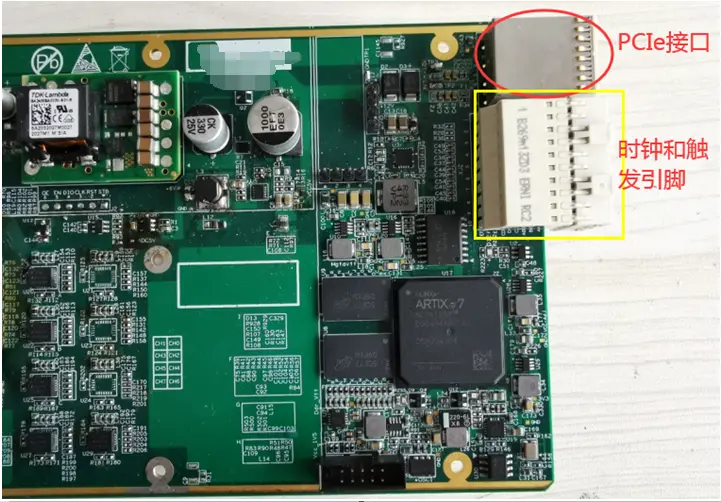

# PXI标准概述

## 缩略语

| Syntax | Description                                                     | Description                                                       |
| :----- | :-------------------------------------------------------------- | :---------------------------------------------------------------- |
| PXI    | PCI eXtensions for Instrumentation                              | 面向仪器系统的PCI扩展                                             |
| PCI    | Peripheral Component Interconnect                               | 外设组件互连标准(或称个人电脑接口（Personal Computer Interface）) |
| PCIE   | PCI Express                                                     | 高速PCI接口？                                                     |
| CPCI   | Compact PCI                                                     | 紧凑型PCI                                                         |
| COTS   | Commercial off-the-shelf (commercially available off-the-shelf) | 商业现货                                                          |

## 什么是PXI

PXI (PCI eXtensions for Instrumentation) is based on and offers all of the benefits of the PCI architecture including performance, industry adoption and COTS technology. PXI has a rugged CompactPCI mechanical form-factor, integrated timing and synchronization that is used to route synchronization clocks, and triggers internally. PXI modules fit into a multi-slot chassis and are configured and managed by a laptop PC and software[1].  

PXI(面向仪器系统的PCI扩展) 是一个基于PC的成熟平台，适用于测量和自动化系统。它提供了电源、冷却和通信总线来支持同一机箱内的多个仪器模块。PXI采用基于PC的商用PCI总线技术，但同时结合了坚固的CompactPCI模块化封装以及重要的定时和同步功能[2]。

### PXI 和 CPCI 以及 PCI 的区别

其实，CPCI 是在 PCI 的基础上发展的来，而 PXI 基本上是在 CPCI 的基础上衍生而来。

- PCI是Peripheral Component Interconnect(外设部件互连标准)的缩写，是工业电脑的主要扩展插槽，也是工业主板板载最多的插槽类型，ATX结构的工业主板一般带有4～6个PCI插槽，而MINI-ITX工业主板也可带有PCI插槽，应用非常广泛。  
PCI总线是一种树型结构，并且独立于CPU总线，可以和CPU总线并行操作。PCI总线上可以挂接PCI设备和PCI桥片，PCI总线上只允许有一个PCI主设备，其他的均为PCI 从设备，而且读写操作只能在主从设备之间进行，从设备之间的数据交换需要通过主设备中转。[3]
PCI规范规定了该总线的物理尺寸（包括线宽）、电气特性、总线时序和协议。该规范可从美国PCI-SIG协会购得。[4]
- CPCI，即 CompactPCI, is a computer bus interconnect for industrial computers,[1] combining a Eurocard-type connector and PCI signaling and protocols.[5]
CPCI总线以PCI电气规范为基础，解决了VME等总线技术与PCI总线不兼容的问题，使得基于PC的X86架构、硬盘存储等技术能在工业领域使用。在机械结构上，CPCI总线结构使用了欧卡连接器和标准3U、6U板卡尺寸。同时由于在接口等地方做了重大改进，使得采用CPCI技术的工业服务器、工业电脑等拥有了高可靠性、高密度的优点。[3]
- PXI(PCI eXtensions for Instrumentation，面向仪器系统的PCI扩展)，是一种专为工业数据采集与自动化应用度身定制的模块化仪器平台，具备机械、电气与软件等多方面的专业特性。是CompactPCI规范的扩展，结合了PCI的电气总线特性与CompactPCI的坚固性、模块化及Eurocard机械封装的特性，并增加了专门的同步总线和主要软件特性[3]。PXI是为了测量领域而制定的标准，因此，在CPCI的基础上，引入了时钟和触发总线（The clocks and triggers are not part of the cPCI standard.  That is where PXI comes in.  Coincidentally, many of your cPCI cards will work in many of your PXI chassis.[6]）。

加入的时钟和触发总线的端子如图[7]:

另外，PCI、PCIX、PCIE、CPCI和PXI的关系，可以看[总线PCI、PCIX、PCIE、CPCI和PXI介绍（转载+编辑）](https://zhuanlan.zhihu.com/p/93396623)

关于PXI的照片：

PXI都定义了哪些标准：机械，硬件，软件

## 机械

## 硬件

## 软件

## 参考及引用

[1] PXI ARCHITECTURE. PXI Systems Alliance <http://www.pxisa.org/About/Architecture/Default.aspx>
[2] PXI机箱与台式机机箱的对比. 电子发烧友 <http://www.elecfans.com/emb/580128_a.html>
[3] 工业电脑中PCI、CPCI、PXI插槽的区别. CSDN <https://blog.csdn.net/wordwarwordwar/article/details/80003603>
[4] 外设组件互连标准. 维基百科 <https://zh.wikipedia.org/wiki/%E5%A4%96%E8%AE%BE%E7%BB%84%E4%BB%B6%E4%BA%92%E8%BF%9E%E6%A0%87%E5%87%86>
[5] CompactPCI. wikipedia <https://en.wikipedia.org/wiki/CompactPCI>
[6] What is the difference between compactPCI and PXI? NI forums <https://forums.ni.com/t5/PXI/What-is-the-difference-between-compactPCI-and-PXI/td-p/3259792?profile.language=zh-CN>
[7] My FPGA PCIe客户案例73：客户自己开发的ARTIX7 PXIe板卡利用LabVIEW My FPGA开发. bilibili <https://www.bilibili.com/read/cv10486741>
