# PXI标准概述

## 缩略语以及专用术语

| Syntax   | Description                                                     | Description                                                       |
| :------- | :-------------------------------------------------------------- | :---------------------------------------------------------------- |
| PXI      | PCI eXtensions for Instrumentation                              | 面向仪器系统的PCI扩展                                             |
| PCI      | Peripheral Component Interconnect                               | 外设组件互连标准(或称个人电脑接口（Personal Computer Interface）) |
| PCIE     | PCI Express                                                     | 高速PCI接口？                                                     |
| CPCI     | Compact PCI                                                     | 紧凑型PCI                                                         |
| COTS     | Commercial off-the-shelf (commercially available off-the-shelf) | 商业现货                                                          |
| VXI      | VME eXtensions for Instrumentation                              | 一种仪器总线规范                                                  |
| Eurocard | European Packaging Specifications                               |                                                                   |

## 什么是PXI

PXI (PCI eXtensions for Instrumentation) is based on and offers all of the benefits of the PCI architecture including performance, industry adoption and COTS technology. PXI has a rugged CompactPCI mechanical form-factor, integrated timing and synchronization that is used to route synchronization clocks, and triggers internally. PXI modules fit into a multi-slot chassis and are configured and managed by a laptop PC and software[1].  

如下图：

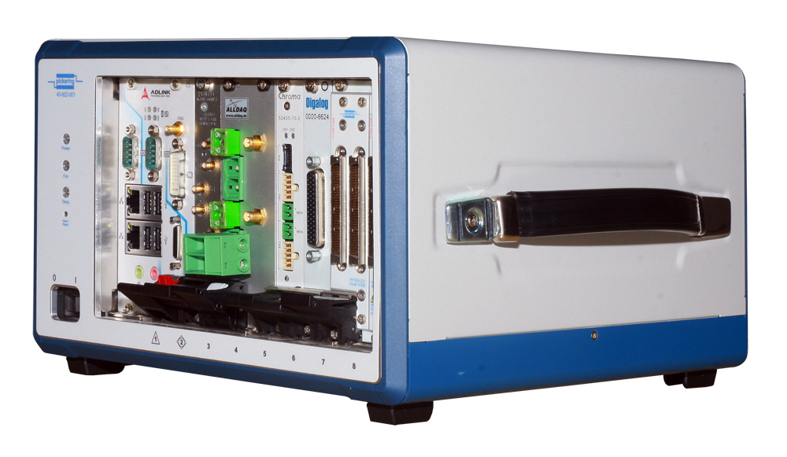

翻译成中文就是：PXI(面向仪器系统的PCI扩展) 是一个基于PC的成熟平台，适用于测量和自动化系统。它提供了电源、冷却和通信总线来支持同一机箱内的多个仪器模块。PXI采用基于PC的商用PCI总线技术，但同时结合了坚固的CompactPCI模块化封装以及重要的定时和同步功能[2]。

相对于CompactPCI，PXI里添加的定时、触发、同步功能对于测量仪器非常重要。

### PXI 和 CPCI 以及 PCI 的区别

其实，CPCI 是在 PCI 的基础上发展的来，而 PXI 基本上是在 CPCI 的基础上衍生而来。

- PCI是Peripheral Component Interconnect(外设部件互连标准)的缩写，是工业电脑的主要扩展插槽，也是工业主板板载最多的插槽类型，ATX结构的工业主板一般带有4～6个PCI插槽，而MINI-ITX工业主板也可带有PCI插槽，应用非常广泛。  
PCI总线是一种树型结构，并且独立于CPU总线，可以和CPU总线并行操作。PCI总线上可以挂接PCI设备和PCI桥片，PCI总线上只允许有一个PCI主设备，其他的均为PCI 从设备，而且读写操作只能在主从设备之间进行，从设备之间的数据交换需要通过主设备中转。[3]
PCI规范规定了该总线的物理尺寸（包括线宽）、电气特性、总线时序和协议。该规范可从美国PCI-SIG协会购得。[4]
- CPCI，即 CompactPCI, is a computer bus interconnect for industrial computers,[1] combining a Eurocard-type connector and PCI signaling and protocols.[5]
CPCI总线以PCI电气规范为基础，解决了VME等总线技术与PCI总线不兼容的问题，使得基于PC的X86架构、硬盘存储等技术能在工业领域使用。在机械结构上，CPCI总线结构使用了欧卡连接器和标准3U、6U板卡尺寸。同时由于在接口等地方做了重大改进，使得采用CPCI技术的工业服务器、工业电脑等拥有了高可靠性、高密度的优点。[3]
- PXI(PCI eXtensions for Instrumentation，面向仪器系统的PCI扩展)，是一种专为工业数据采集与自动化应用度身定制的模块化仪器平台，具备机械、电气与软件等多方面的专业特性。是CompactPCI规范的扩展，结合了PCI的电气总线特性与CompactPCI的坚固性、模块化及Eurocard机械封装的特性，并增加了专门的同步总线和主要软件特性[3]。PXI是为了测量领域而制定的标准，因此，在CPCI的基础上，引入了时钟和触发总线（The clocks and triggers are not part of the cPCI standard.  That is where PXI comes in.  Coincidentally, many of your cPCI cards will work in many of your PXI chassis.[6]）。

另外，PCI、PCIX、PCIE、CPCI和PXI的关系，可以看[总线PCI、PCIX、PCIE、CPCI和PXI介绍（转载+编辑）](https://zhuanlan.zhihu.com/p/93396623)

### 谁在主导PXI

[PXI 系统联盟](https://www.pxisa.org/)（PXI Systems Alliance）。

PCI eXtensions for Instrumentation (PXI) is a modular instrumentation platform originally introduced in 1997 by National Instruments. PXI is promoted by the 69-member PXI Systems Alliance (PXISA), whose sponsor members are (in alphabetical order) ADLINK, Cobham Wireless, Keysight Technologies, Marvin Test Solutions, National Instruments, Pickering Interfaces and Teradyne.

Executive Members of the alliance include Alfamation, Beijing Pansino Solutions Technology Co. (即北京中科泛华测控技术有限公司), CHROMA ATE Inc, GOEPEL electronic, MAC Panel, and Virginia Panel Corp. Another 56 associate member organizations that do not have voting rights are supporting PXI and use the PXI logo on their products and marketing material[7].

NI 作为最先提出该标准的厂商，在所有推出PXI相关仪器设备的商家中，NI是推出仪器设备最多的，他们声称自己有600种不同的PXI模块。如示波器，万用表，源表，射频分析仪，信号发生器等等。

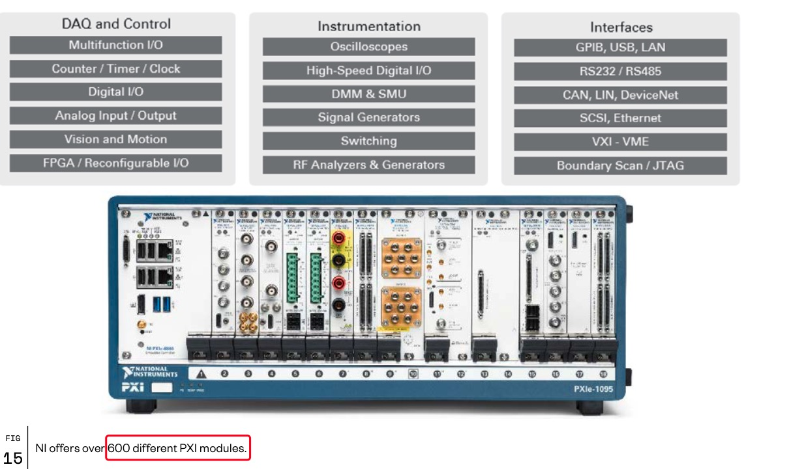

NI有不同的PXI机箱：

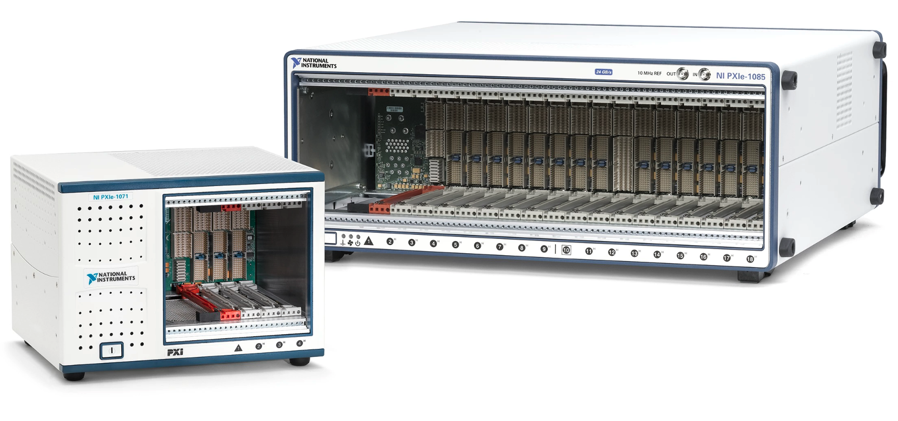

以及各式各样的PXI模块：

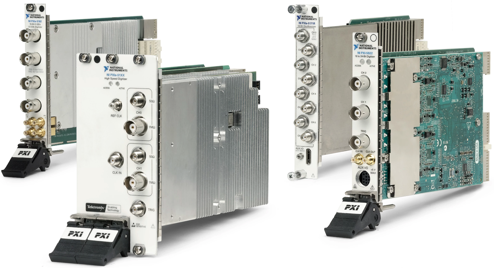

### PXIE

PXIE 这里是指PXI Express。其实就是兼容PCIE接口的PXI标准，也就是PXI-PCI，PXIE对PCIE。  
PXI Express is an adaptation of PCI Express to the PXI form factor, developed in 2005. This increases the available system data rate to 6 GByte/s in each direction. PXI Express also allows for the use of hybrid slots, compatible with both PXI and PXI Express modules. In 2015 National Instruments extended the standard to use PCI Express 3.x, increasing the system bandwidth to 24 GByte/s[7].

注：24 GByte/s 应该是一个16通道和一个8通道的PCIE的传输速率，若是4路4通道的，速率只能是 16GByte/s.  

## PXI 标准的架构

[根据PXI联盟](https://www.pxisa.org/)（PXI Systems Alliance）官方网站，可以下载PXI相关标准定义文件，从文件中，可以查看到 PXI 标准定义的架构，架构包括：

- 机械架构
- 硬件架构（Electrical Architecture 电气结构）
- 软件架构

注：如无特殊说明，本中的硬件均指电气结构，不含机械结构。不过官方文档中，硬件包含机械和电气。

如下图[8]：

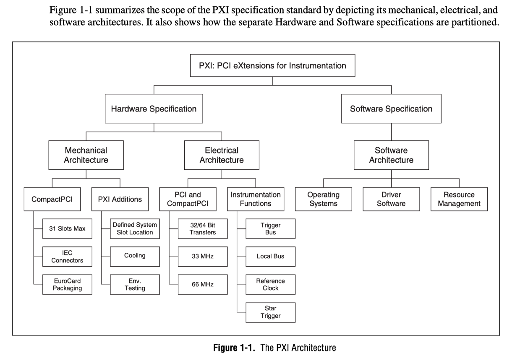

从图中可以看出，机械结构和硬件结构基本是在CompactPCI的基础上添加新的特性。因此，许多标准，比如板卡结构，应该是去CompactPCI找对应的标准了。  

软件上，PXI系统定义了：

1. 操作系统
2. 驱动程序
3. 资源管理

机械结构上，PXI在CompactPCI的基础上添加了：

1. 定义系统槽的位置（机箱左侧）
2. 冷却系统（风道位置和流向等）
3. 环境测量（机箱内部环境）

硬件（电气结构）上， PXI 在 CompactPCI 和 PCI 的基础上添加了：

1. 触发总线
2. 本地总线（Local Bus），本地总线指什么？
3. 参考时钟
4. 开始触发（PXIE没有这个信号：**RULE: A PXI Express Chassis SHALL NOT have a Star Trigger Slot as defined in the PXI-1 Specification.**）

另外，PXIE的 Hardware 标准文档中，介绍PXIE架构的导图将软件独立开来，硬件架构如下（包含机械架构和电气架构）：

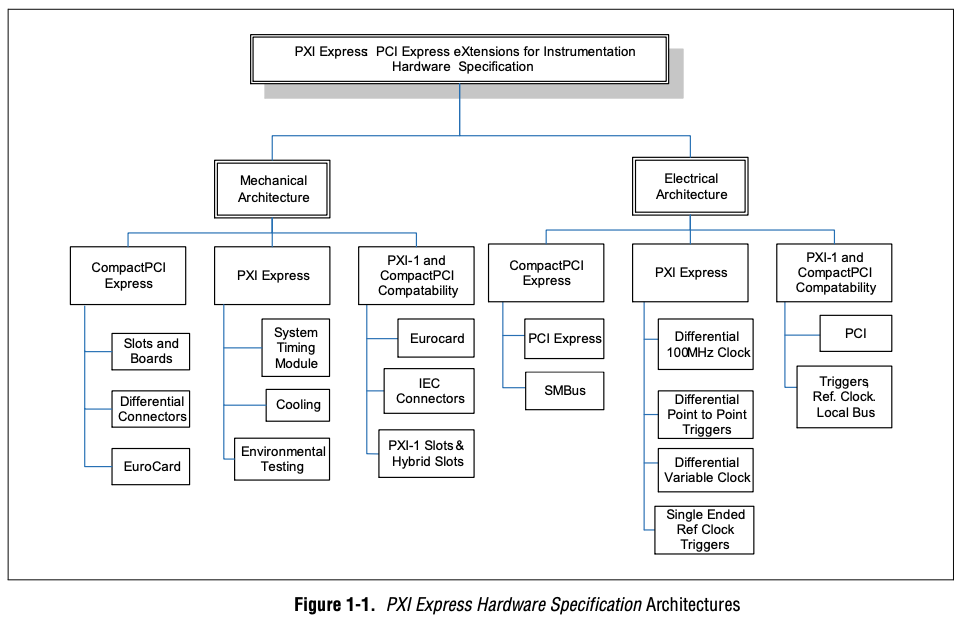

鉴于PXIE是相对PXI较新的标准，下面不管是机械结构还是软件，硬件，如无特殊说明，基本都是以PXIE为准。机械结构基本是以3U的机箱高度为示例，6U高度的机箱连同其板卡一般较少见，不再举例。

## 机械结构

机械结构包含机箱、模块板卡、端子的机械结构定义。

### 机箱结构

机箱高度分为3U和6U，下面是标准文档中3U高度的示例[8]：

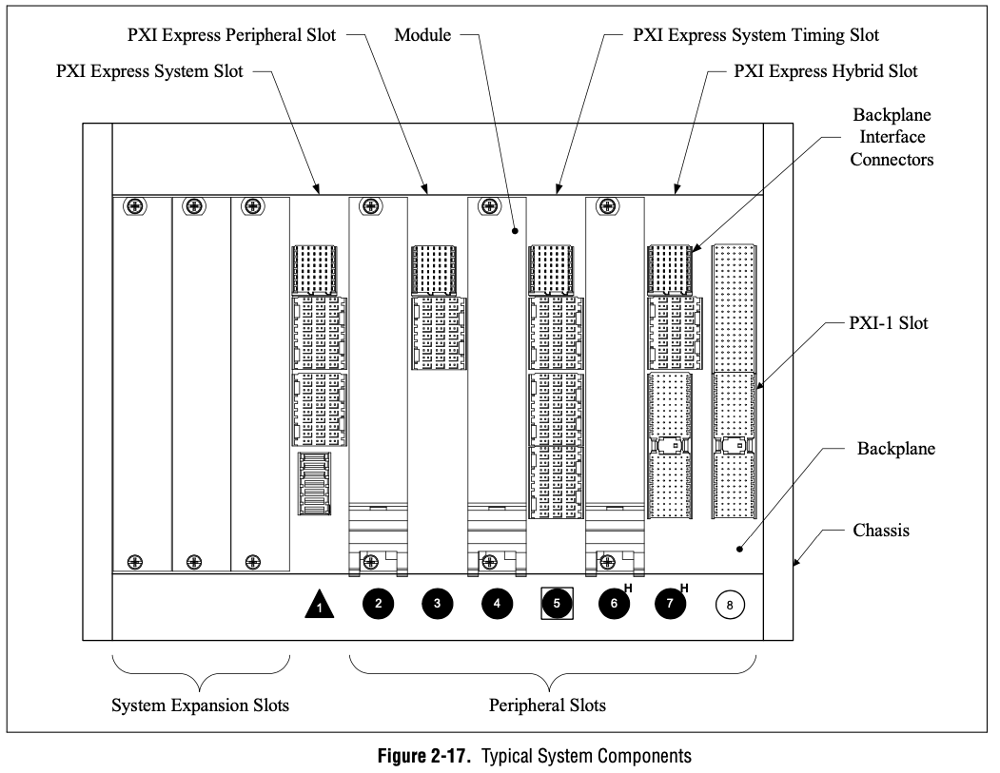

图中有多个不同的槽（slot），包含：

- 系统槽（PXI Express System Slot）：系统板卡槽，一般在机箱的左边，通常占用4个槽的宽度，标准的PXIE可以是Windows软硬件系统或者Linux软硬件系统。
- 外设槽（PXI EXpress Peripheral Slot）：普通PXIE板卡的槽位
- 系统时钟槽（PXI Express System Timing Slot）：作为星形时钟和触发的输出节点
- 混合槽（PXI Express Hybrid Slot）：兼容PXI和PXIE板卡的槽位

其中，已经有三个外设插槽（插槽位置：2、4、6）已经插入模块。  
每个槽的宽度是20.32 mm 或者 0.8 in。

### 板卡结构

板卡高度分为3U和6U，下面是标准文档中3U高度板卡的示例[8]：

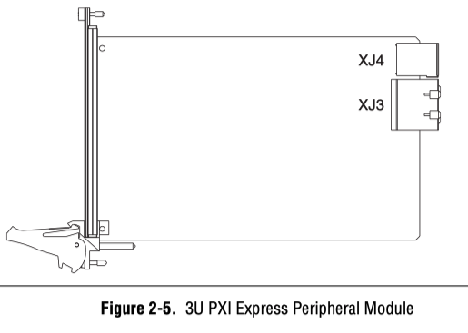

根据定义，其中 XJ4 为触发和时钟接口， XJ3 为通信接口（兼容CompactPCIE端子和协议，也就是兼容PCIE的通信协议）。

实物照片：

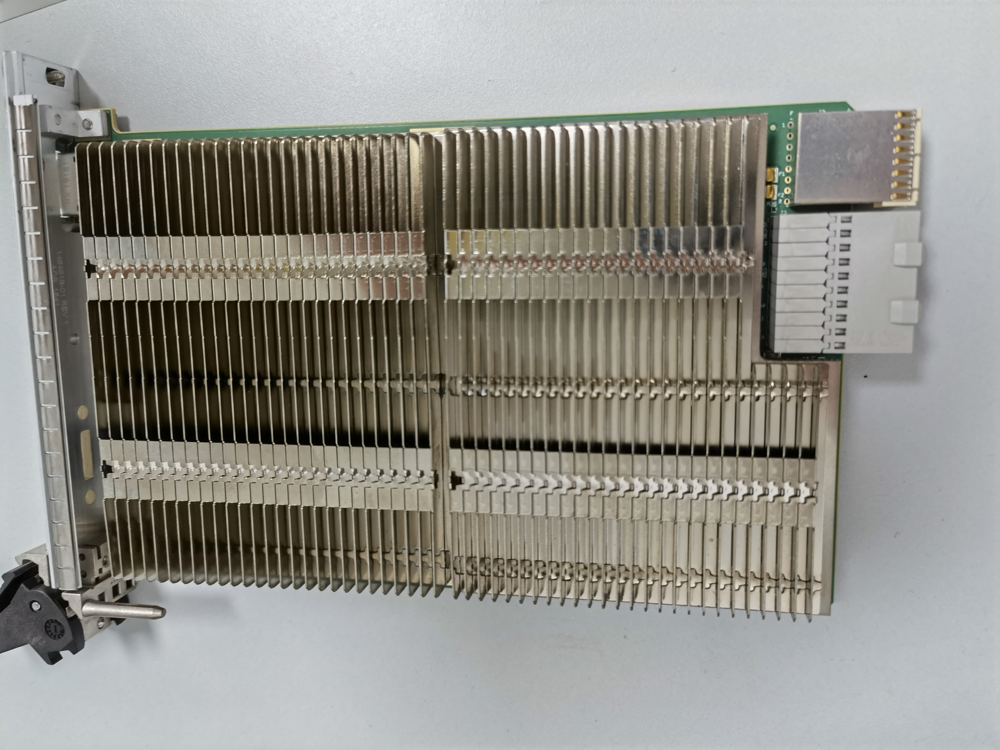

因为PXI是定义了风道方向的，图中散热片的鳍状片是顺着风向的。

板卡尺寸：根据上面的PXI标准架构图，我们知道，PXI兼容的是CompactPCI的结构，包括模块板卡，而CompactPCI的PCB是兼容 [Eurocard](https://en.wikipedia.org/wiki/Eurocard_(printed_circuit_board)) (printed circuit board)标准的，根据维基百科的此条，我们知道 Eurocard 的大小，如下图：

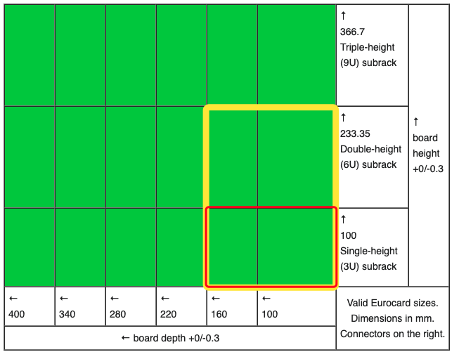

其中，红框和黄框才是 PXI 所使用的标准板卡，红框对应3U机箱，而黄框对应6U机箱。所以PCB大小为：

- 3U 机箱：100mm \* 160mm
- 6U 机箱：233.35mm \* 160mm

疑问：

- PCB板厚度呢？是1.6mm还是2mm ？
- 定位孔（固定孔）相对位置坐标是多少？
- PCB直角的倒角规则有没有？

### 端子结构

我们知道，端子有主控端子，外设端子，以及系统时钟端子。下图只是展现PXIE-3U-外设模块端子（PXI标准的，6U的，主控的，系统时钟的，不再赘述）：

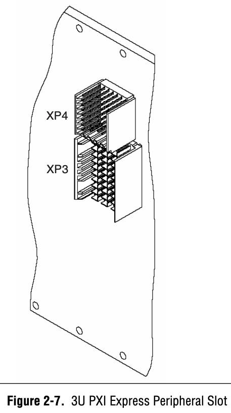

上图为主机背板上的座子，公头（标准文档以P表示公头，J表示母头），背板的XP3，XP4，对应的是模块上的XJ3，XJ4，见下图：

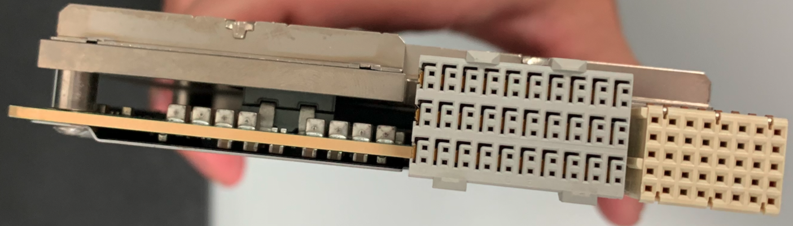

根据PXIE硬件标准[8]：**3.6.1 Module Connector Requirements**

- **RULE**: PXI Express Modules SHALL use the **ADF-F-3-10-2-F-25** connector as defined by the CompactPCI Express specification.  
- **RULE**: PXI Express Modules SHALL use the **eHM-F2** connector as defined by the CompactPCI Express specification.  
- **RULE**: System Controller Modules SHALL use the **UPM-M-7** or **UPM-M-7-HP** connector as defined by the CompactPCI Express specification.

PXIE背板的端子，PXI兼容的模块端子，以及系统板卡的端子，这里不再列举型号。需要的可以去标准文件中查找。

淘宝中查找“eHM-F2”，得到链接 <https://item.taobao.com/item.htm?spm=a230r.1.14.16.20a37c662CO6am&id=573208118080&ns=1&abbucket=14#detail>，对应的端子：

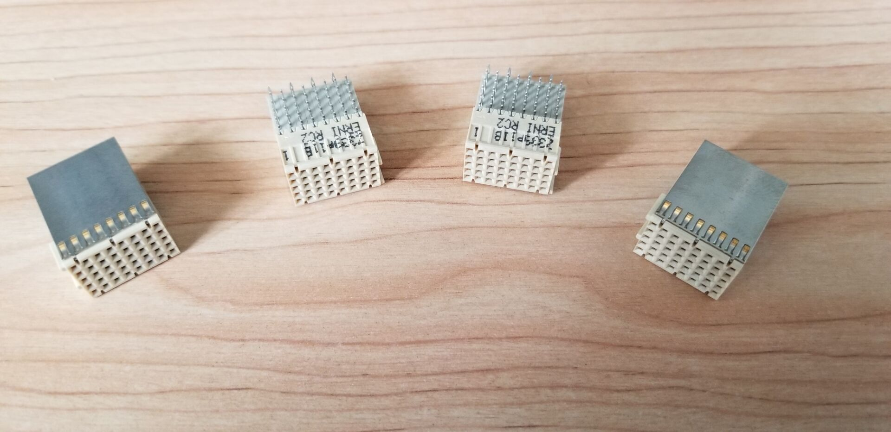

这个与使用CPCI关键字找到的另一个端子：ERNI214443，看起来是一样的，链接 <https://item.taobao.com/item.htm?spm=a230r.1.14.145.60ec6a5bpzIJAa&id=644499487590&ns=1&abbucket=14#detail>，端子照片：

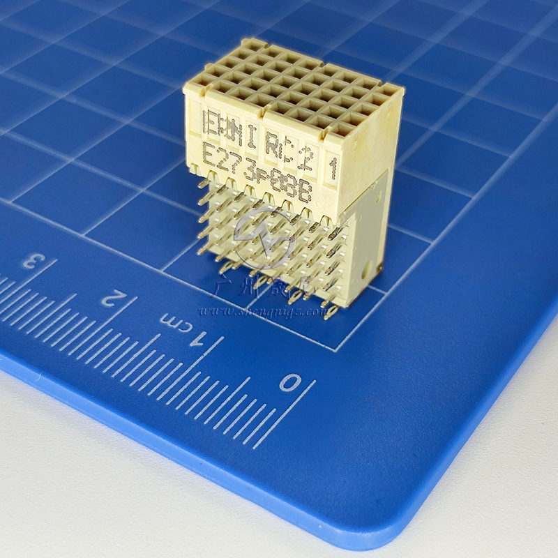

不过，根据网页描述，这个端子的插拔次数才250次，这也太少了。

在google中查找 “ADF-F-3-10-2-F-25” 找到对应的供应商型号：ERNI 973028，如下图：

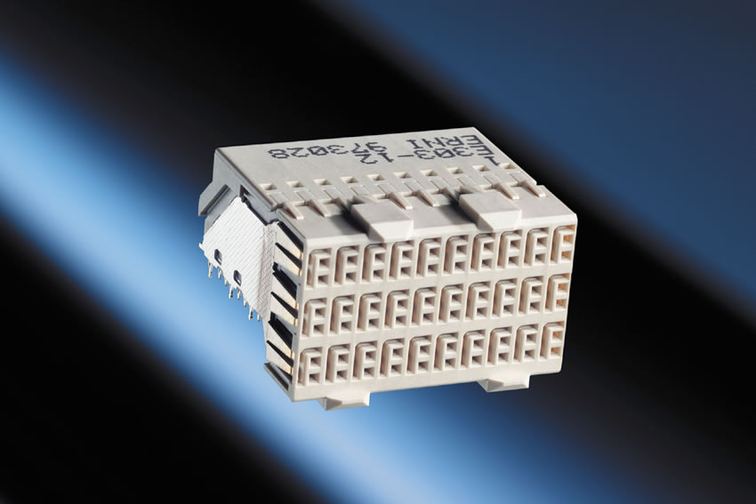

在淘宝上搜索，就有许多对应的器件了，如 <https://item.taobao.com/item.htm?spm=a230r.1.14.170.34ab927eJq1dvJ&id=570187622258&ns=1&abbucket=14#detail>，以及 <https://item.taobao.com/item.htm?spm=a1z10.3-c-s.w4002-21252187955.10.7f591cb7pNaNP5&id=642719157971>。

其实，直接在淘宝搜索CPCI就能找到这些的了，但搜索CPCI出来的端子太多了。

## 硬件

硬件包括端子引脚定义、逻辑电平、阻抗特性、时钟和信号时序以及供电电源等定义。

PXIE总线连接框架

### 端子引脚定义

#### 主控端子

PXIE 主控插槽的引脚既可以定义为4个4通道的PCIE，也可以定义为一个8通道的和一个16通道的PCIE（当然了，4*4 < 8+16，他们实际使用的引脚数量不一样）。

4个连接[8]:

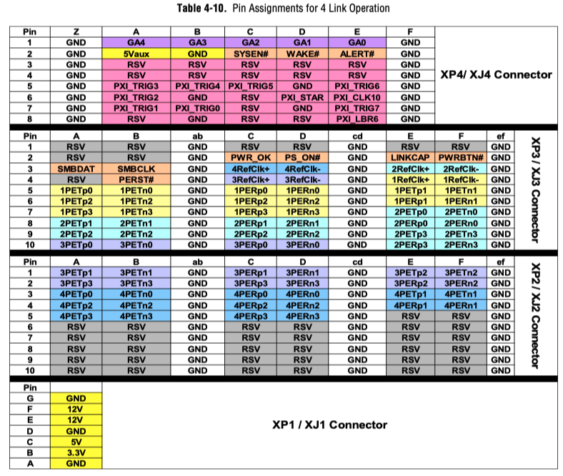

2个连接[8]:

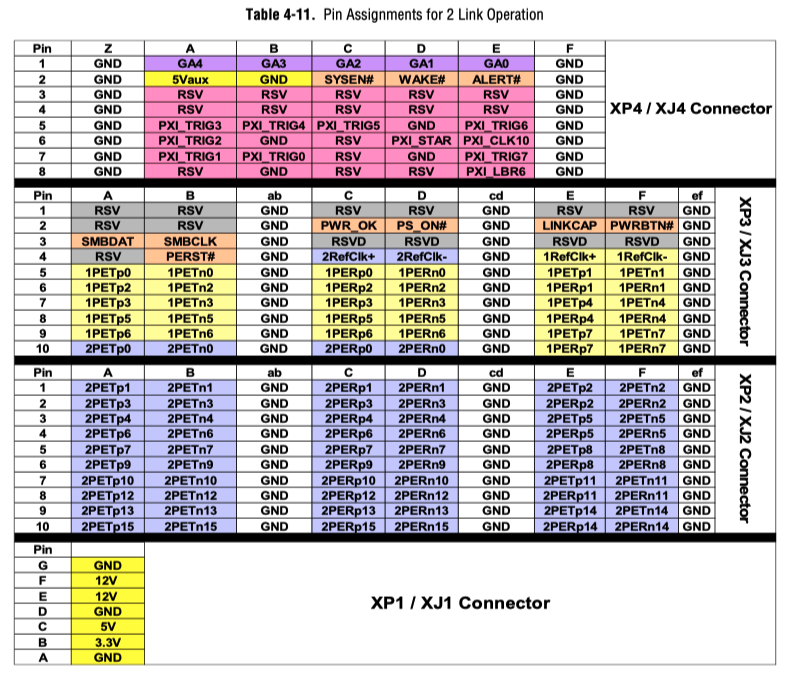

#### 外设端子

PXIE 外设插槽引脚定义如下[8]:

可以看出，这个应该是支持8通道的PCIE的，因为他的接口包含了8对输入和8对输出： 1PER0-7(n-p) ，1PET0-7(n-p)

#### 系统时钟端子

PXIE时钟插槽引脚定义如下[8]：

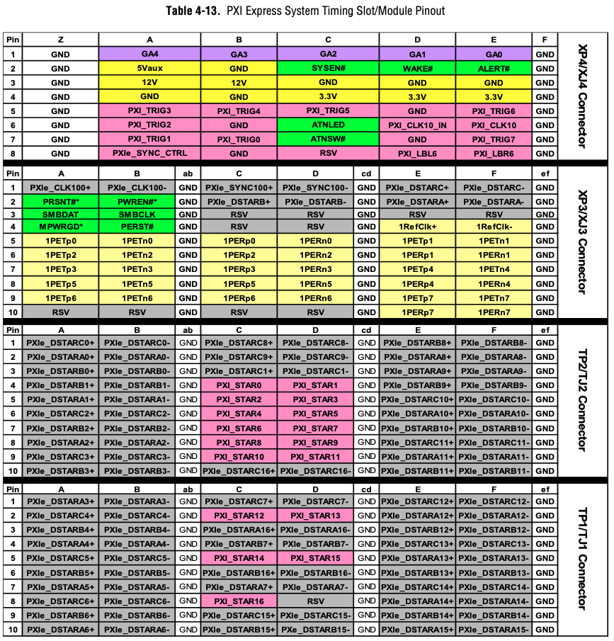

时钟插槽是兼容普通外设模块的，若以普通的PXIE外设模块插入，那么使用的是XP4/XJ4，XP3/XJ3端子。TP1/TJ1，TP2/TJ2不起作用。

### 逻辑电平及阻抗特性

### 时钟和同步信号时序

### 供电电源

## 软件

## 产业

根据[PXI联盟官网](https://www.pxisa.org/About/MarketAcceptance.aspx)，最近每年PXI产业的产值都快速增长。

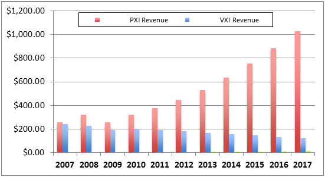

虽然2017年刚超过10亿美元，但若是看增长曲线，这10年间的增长非常可观。

而另一方面，VXI的营收是一直下降的。

## 参考及引用

[1] PXI ARCHITECTURE. PXI Systems Alliance <http://www.pxisa.org/About/Architecture/Default.aspx>
[2] PXI机箱与台式机机箱的对比. 电子发烧友 <http://www.elecfans.com/emb/580128_a.html>
[3] 工业电脑中PCI、CPCI、PXI插槽的区别. CSDN <https://blog.csdn.net/wordwarwordwar/article/details/80003603>
[4] 外设组件互连标准. 维基百科 <https://zh.wikipedia.org/wiki/%E5%A4%96%E8%AE%BE%E7%BB%84%E4%BB%B6%E4%BA%92%E8%BF%9E%E6%A0%87%E5%87%86>
[5] CompactPCI. Wikipedia <https://en.wikipedia.org/wiki/CompactPCI>
[6] What is the difference between compactPCI and PXI? NI forums <https://forums.ni.com/t5/PXI/What-is-the-difference-between-compactPCI-and-PXI/td-p/3259792?profile.language=zh-CN>
[7] PCI eXtensions for Instrumentation. Wikipedia <https://en.wikipedia.org/wiki/PCI_eXtensions_for_Instrumentation>
[8] PXI Express Hardware Specification-PCI EXPRESS eXtensions for Instrumentation. An Implementation of CompactPCI Express. Revision 1.1 May 31, 2018. PXI Systems Alliance <https://www.pxisa.org/userfiles/files/Specifications/PXI5_PXIExpressHW_r11.pdf>
[9] My FPGA PCIe客户案例73：客户自己开发的ARTIX7 PXIe板卡利用LabVIEW My FPGA开发. bilibili <https://www.bilibili.com/read/cv10486741>
