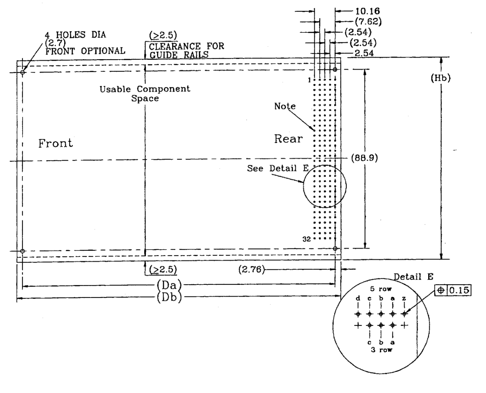
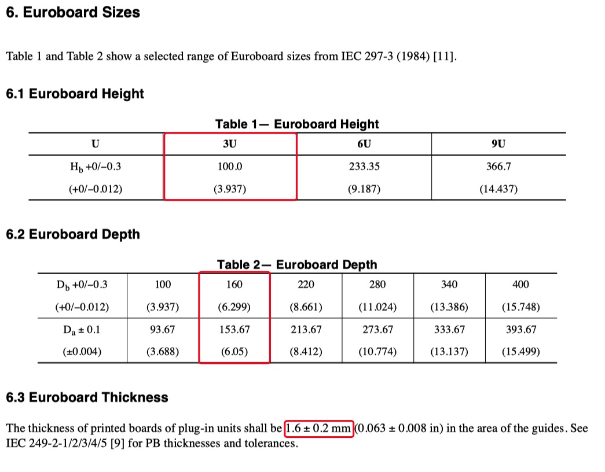
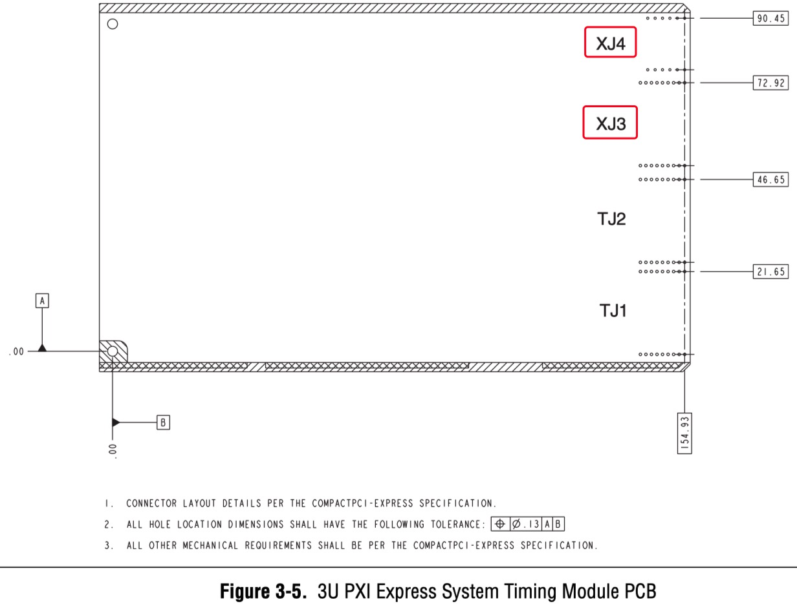
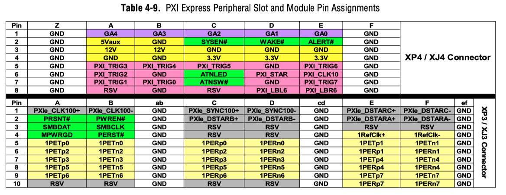
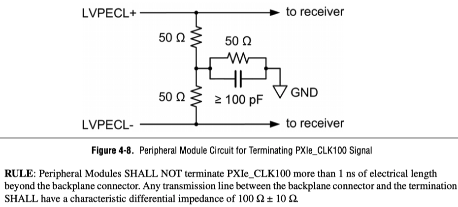
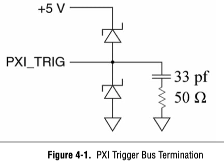
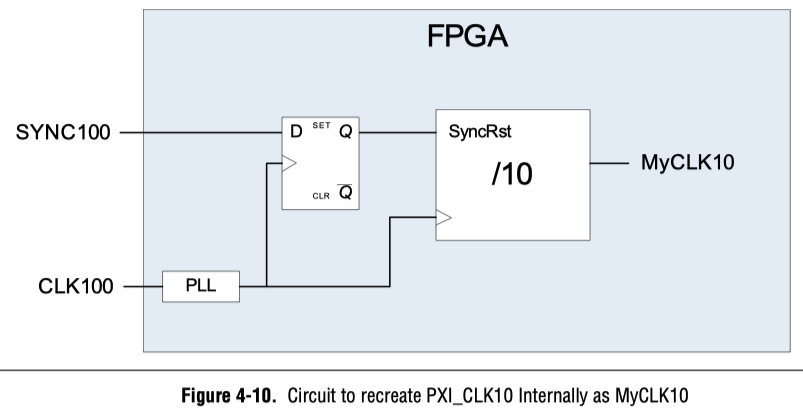
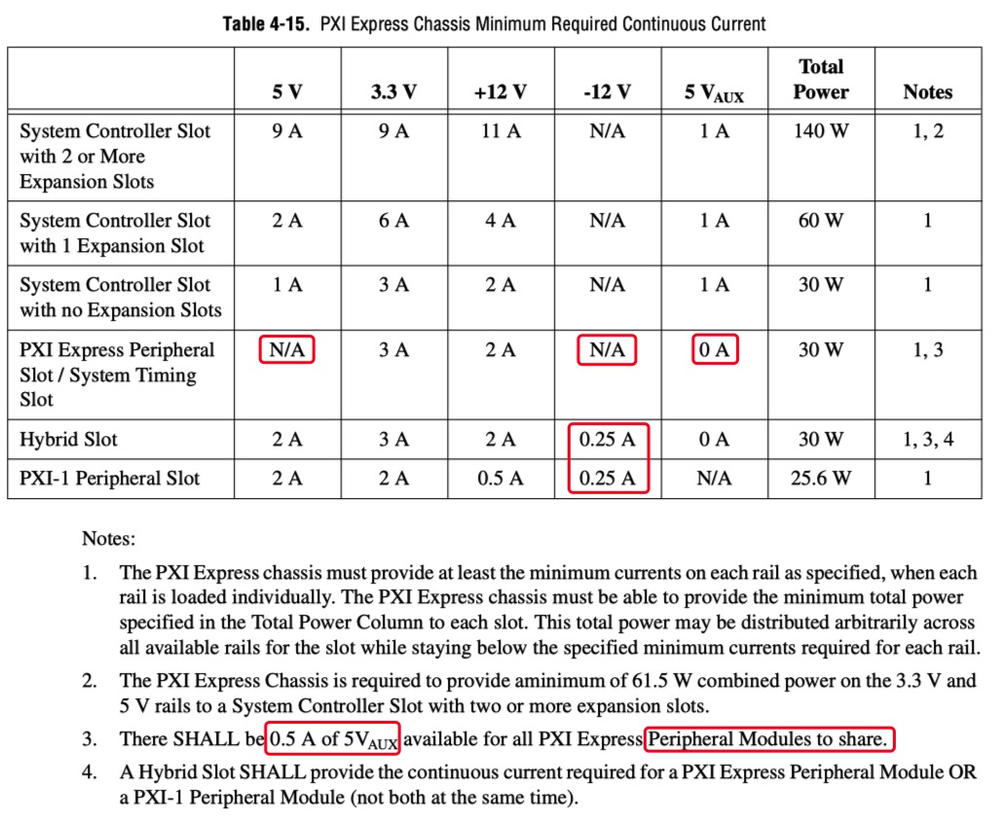

# PXI标准概述

## 缩略语以及专用术语

| 缩略词   | 英文全称                                                        | 中文全称              |
| :------- | :-------------------------------------------------------------- | :-------------------- |
| PXI      | PCI eXtensions for Instrumentation                              | 面向仪器系统的PCI扩展 |
| PCI      | Peripheral Component Interconnect                               | 外设组件互连标准      |
| PCIE     | PCI Express                                                     | 高速PCI接口           |
| CPCI     | Compact PCI                                                     | 紧凑型PCI             |
| COTS     | Commercial off-the-shelf (commercially available off-the-shelf) | 商业现货              |
| VXI      | VME eXtensions for Instrumentation                              | 一种仪器总线规范      |
| Eurocard | European Packaging Specifications                               |                       |
| PICMG    | PCI Industrial Computer Manufacturers Group                     |                       |

## 什么是PXI

PXI (PCI eXtensions for Instrumentation) is based on and offers all of the benefits of the PCI architecture including performance, industry adoption and COTS technology. PXI has a rugged CompactPCI mechanical form-factor, integrated timing and synchronization that is used to route synchronization clocks, and triggers internally. PXI modules fit into a multi-slot chassis and are configured and managed by a laptop PC and software[1].  

如下图：

翻译成中文就是：PXI(面向仪器系统的PCI扩展) 是一个基于PC的成熟平台，适用于测量和自动化系统。它提供了电源、冷却和通信总线来支持同一机箱内的多个仪器模块。PXI采用基于PC的商用PCI总线技术，但同时结合了坚固的CompactPCI模块化封装以及重要的定时和同步功能[2]。

相对于CompactPCI，PXI里添加的定时、触发、时钟同步功能对于测量仪器非常重要。

### PXI 和 CPCI 以及 PCI 的区别

其实，CPCI 是在 PCI 的基础上发展的来，而 PXI 基本上是在 CPCI 的基础上衍生而来。

- PCI是Peripheral Component Interconnect(外设部件互连标准)的缩写，是工业电脑的主要扩展插槽，也是工业主板板载最多的插槽类型，ATX结构的工业主板一般带有4～6个PCI插槽，而MINI-ITX工业主板也可带有PCI插槽，应用非常广泛。  
PCI总线是一种树型结构，并且独立于CPU总线，可以和CPU总线并行操作。PCI总线上可以挂接PCI设备和PCI桥片，PCI总线上只允许有一个PCI主设备，其他的均为PCI 从设备，而且读写操作只能在主从设备之间进行，从设备之间的数据交换需要通过主设备中转。[3]
PCI规范规定了该总线的物理尺寸（包括线宽）、电气特性、总线时序和协议。该规范可从美国PCI-SIG协会购得。[4]
- CPCI，即 CompactPCI, is a computer bus interconnect for industrial computers, combining a Eurocard-type connector and PCI signaling and protocols.[5]
CPCI总线以PCI电气规范为基础，解决了VME等总线技术与PCI总线不兼容的问题，使得基于PC的X86架构、硬盘存储等技术能在工业领域使用。在机械结构上，CPCI总线结构使用了欧卡连接器和标准3U、6U板卡尺寸。同时由于在接口等地方做了重大改进，使得采用CPCI技术的工业服务器、工业电脑等拥有了高可靠性、高密度的优点。[3]
- PXI(PCI eXtensions for Instrumentation，面向仪器系统的PCI扩展)，是一种专为工业数据采集与自动化应用度身定制的模块化仪器平台，具备机械、电气与软件等多方面的专业特性。是CompactPCI规范的扩展，结合了PCI的电气总线特性与CompactPCI的坚固性、模块化及Eurocard机械封装的特性，并增加了专门的同步总线和主要软件特性[3]。PXI是为了测量领域而制定的标准，因此，在CPCI的基础上，引入了时钟和触发总线（The clocks and triggers are not part of the cPCI standard.  That is where PXI comes in.  Coincidentally, many of your cPCI cards will work in many of your PXI chassis.[6]）。

另外，PCI、PCIX、PCIE、CPCI和PXI的关系，可以看[总线PCI、PCIX、PCIE、CPCI和PXI介绍（转载+编辑）](https://zhuanlan.zhihu.com/p/93396623)

### 谁在主导PXI

[PXI 系统联盟](https://www.pxisa.org/)（PXI Systems Alliance）。

PCI eXtensions for Instrumentation (PXI) is a modular instrumentation platform originally introduced in 1997 by National Instruments. PXI is promoted by the 69-member PXI Systems Alliance (PXISA), whose sponsor members are (in alphabetical order) ADLINK, Cobham Wireless, Keysight Technologies, Marvin Test Solutions, National Instruments, Pickering Interfaces and Teradyne.

Executive Members of the alliance include Alfamation, Beijing Pansino Solutions Technology Co. (即北京中科泛华测控技术有限公司), CHROMA ATE Inc, GOEPEL electronic, MAC Panel, and Virginia Panel Corp. Another 56 associate member organizations that do not have voting rights are supporting PXI and use the PXI logo on their products and marketing material[7].

NI 作为最先提出该标准的厂商，在所有推出PXI相关仪器设备的商家中，NI是推出仪器设备最多的，他们声称自己有600种不同的PXI模块。如示波器，万用表，源表，射频分析仪，信号发生器等等。

NI有不同的PXI机箱：

以及各式各样的PXI模块：

### PXIE

PXIE 这里是指PXI Express。其实就是兼容PCIE接口的PXI标准，也就是PXI-PCI，PXIE对PCIE。  
PXI Express is an adaptation of PCI Express to the PXI form factor, developed in 2005. This increases the available system data rate to 6 GByte/s in each direction. PXI Express also allows for the use of hybrid slots, compatible with both PXI and PXI Express modules. In 2015 National Instruments extended the standard to use PCI Express 3.x, increasing the system bandwidth to 24 GByte/s[7].

注：24 GByte/s 应该是一个16通道和一个8通道的PCIE的传输速率，若是4路4通道的，速率只能是 16GByte/s.  

## PXI 标准的架构

[根据PXI联盟](https://www.pxisa.org/)（PXI Systems Alliance）官方网站，可以下载PXI相关标准定义文件，从文件中，可以查看到 PXI 标准定义的架构，架构包括：

- 机械架构
- 硬件架构（Electrical Architecture 电气结构）
- 软件架构

注：如无特殊说明，本中的硬件均指电气结构，不含机械结构。不过官方文档中，硬件包含机械和电气。

如下图[8]：

从图中可以看出，机械结构和硬件结构基本是在CompactPCI的基础上添加新的特性。因此，许多标准，比如板卡结构，应该是去CompactPCI找对应的标准了。  

不过，下文中很少出现CompactPCI相关的文档，因为他们家（ [PICMG](https://www.picmg.org/) ）提供的说明书太贵了，比如 [Keying of CompactPCI® Boards and Backplanes Specification](https://www.picmg.org/product/keying-compactpci-boards-backplanes-specification/) 就要750美刀。相比起来，PXI的说明书免费下载，不要太爽。

软件上，PXI系统定义了：

1. 操作系统
2. 驱动程序
3. 资源管理

机械结构上，PXI在CompactPCI的基础上添加了：

1. 定义系统槽的位置（机箱左侧）
2. 冷却系统（风道位置和流向等）
3. 环境测量（机箱内部环境）

硬件（电气结构）上， PXI 在 CompactPCI 和 PCI 的基础上添加了：

1. 触发总线
2. 本地总线（Local Bus），本地总线指什么？
3. 参考时钟
4. 开始触发（PXIE没有这个信号：**RULE: A PXI Express Chassis SHALL NOT have a Star Trigger Slot as defined in the PXI-1 Specification.**）

另外，PXIE的 Hardware 标准文档中，介绍PXIE架构的导图将软件独立开来，硬件架构如下（包含机械架构和电气架构）：

鉴于PXIE是相对PXI较新的标准，下面不管是机械结构还是软件，硬件，如无特殊说明，基本都是以PXIE为准。机械结构基本是以3U的机箱高度为示例，6U高度的机箱连同其板卡一般较少见，不再举例。

## 机械结构

机械结构包含机箱、模块板卡、端子的机械结构定义。

### 机箱结构

机箱高度分为3U和6U，下面是标准文档中3U高度的示例[8]：

图中有多个不同的槽（slot），包含：

- 系统主控槽（PXI Express System Slot）：对应**系统主控模块**，一般在机箱的左边，通常占用4个槽的宽度，标准的PXIE可以是Windows软硬件系统或者Linux软硬件系统。
- 外设槽（PXI EXpress Peripheral Slot）：对应普通PXIE**外设模块**
- 系统时钟槽（PXI Express System Timing Slot）：作为星形时钟和触发的输出节点，对应**系统时钟模块**
- 混合槽（PXI Express Hybrid Slot）：兼容PXI和PXIE的**外设模块**

上图中，已经有三个外设插槽（插槽位置：2、4、6）已经插入模块。  
每个槽的宽度是**20.32 mm 或者 0.8 in**。

除了NI，国内也有许多厂家制作标准的PXI和PXIE机箱，如有需要，直接购买符合要求的机箱即可。

### 板卡结构

板卡高度分为3U和6U，下面是标准文档中3U高度**外设模块**板卡的示例[8]：

根据定义，其中 XJ4 为触发和时钟接口， XJ3 为通信接口（兼容CompactPCIE端子和协议，也就是兼容PCIE的通信协议）。

外设模块实物照片：

因为PXI是定义了风道方向的，图中散热片的鳍状散热片是顺着风向的。

模块板卡（系统主控模块，系统时钟模块，外设模块都一样）尺寸：根据上面的PXI标准架构图，我们知道，PXI兼容的是CompactPCI的结构，包括模块板卡，而CompactPCI的PCB是兼容 [Eurocard](https://en.wikipedia.org/wiki/Eurocard_(printed_circuit_board)) (printed circuit board)标准的，根据维基百科的此条，我们知道 Eurocard 的大小，如下图：

其中，红框和黄框才是 PXI 所使用的标准板卡尺寸，红框对应3U机箱，而黄框对应6U机箱。所以PCB大小为(PCB板厚在后面会介绍，是1.6±0.2mm)：

- 3U 机箱：100mm \* 160mm \* 1.6mm
- 6U 机箱：233.35mm \* 160mm \* 1.6mm

同时，上面的维基百科词条里说到：The Eurocard mechanical architecture was defined originally under IEC-60297-3. Today, the most widely recognized standards for this mechanical structure are IEEE 1101.1, IEEE 1101.10 (also known commonly as "dot ten") and IEEE 1101.11. **IEEE 1101.10 covers** the additional mechanical and electromagnetic interference features required for VITA 1.1-1997(R2002), which is the VME64 Extensions standard, as well as **PICMG 2.0 (R3.0)**, which is the CompactPCI specification.

同时，根据PXIE硬件标准[8]，**3.3 Chassis Subrack Mechanical Requirements**：
**RULE**: Just as with PXI-1, CompactPCI, and CompactPCI Express, a PXI Express Chassis SHALL use **PICMG 2.0**-compliant Chassis Subracks.

也就是，IEEE 1101.10覆盖了PXIE所需要的PICMG 2.0标准，那我们就查看[IEEE 1101.10](https://ieeexplore.ieee.org/document/588320)标准中的相关描述即可。其中：Figure 20— 3U plug-in unit printed board with typical IEC 603-2 Type C, 3-row and expanded 5-row connector pin layout 如下：

图中不只有PCB外框尺寸，也有端子引脚位置（但端子引脚位置很明显不适用于PXIE），还有PCB上需要为导轨让出的空位，以及定位孔的位置尺寸。

其中，Hb, Da, Db以及PCB厚度需要从 [IEEE 1101.1](https://ieeexplore.ieee.org/document/211187/) 查看，如下：

PXIE 端子位置，根据PXIE硬件标准[8]：**3.7 New Module and Slot Types**，我们可以找到**系统时钟模块**的端子位置，其中，XJ3，XJ4，就是普通**外设模块**需要的端子位置了，如下：

当然，根据PXIE硬件标准[8]，也可以自行翻阅**CompactPCI Express specification**。PXIE硬件标准中 **RULE** 描述如下：  
**RULE:** 3U **PXI Express Peripheral Slots** SHALL meet the mechanical requirements for **3U Type 2** Peripheral Slots as defined in the **CompactPCI Express specification.**  

### 端子结构

我们知道，端子有系统主控模块端子，外设模块端子，以及系统时钟模块端子。下图只是展现PXIE-3U-外设模块端子（而其他关于PXI标准或PXIE-PXI混合标准的，6U机箱高度的，主控模块的，系统时钟模块的特定端子，不再赘述，需要的可以去标准文件中查找。）：

上图为主机背板上的座子，公头（标准文档以P表示公头，J表示母头），背板的XP3，XP4，对应的是外设模块上的XJ3，XJ4，外设模块端子见下图：

关于外设模块的端子，根据PXIE硬件标准[8]：**3.6.1 Module Connector Requirements**

- **RULE**: PXI Express Modules SHALL use the **ADF-F-3-10-2-F-25** connector as defined by the CompactPCI Express specification.  
- **RULE**: PXI Express Modules SHALL use the **eHM-F2** connector as defined by the CompactPCI Express specification.  
- **RULE**: System Controller Modules SHALL use the **UPM-M-7** or **UPM-M-7-HP** connector as defined by the CompactPCI Express specification.

淘宝中查找“eHM-F2”，得到链接 <https://item.taobao.com/item.htm?spm=a230r.1.14.16.20a37c662CO6am&id=573208118080&ns=1&abbucket=14#detail>，对应的端子：

这个与使用CPCI关键字找到的另一个端子：ERNI214443，看起来是一样的，链接 <https://item.taobao.com/item.htm?spm=a230r.1.14.145.60ec6a5bpzIJAa&id=644499487590&ns=1&abbucket=14#detail>，端子照片：

不过，根据网页描述，这个端子的插拔次数才250次，这也太少了，是不是商家胡乱写的？

在google中查找 “ADF-F-3-10-2-F-25” 找到对应的供应商型号：ERNI 973028，如下图：

在淘宝上搜索，就有许多对应的器件了，如 <https://item.taobao.com/item.htm?spm=a230r.1.14.170.34ab927eJq1dvJ&id=570187622258&ns=1&abbucket=14#detail>，以及 <https://item.taobao.com/item.htm?spm=a1z10.3-c-s.w4002-21252187955.10.7f591cb7pNaNP5&id=642719157971>。

其实，直接在淘宝搜索CPCI就能找到这些的了（CPCI非官方标准写法，但用标准写法：**Compact PCI 或 Compact PCI 端子**，找不到），只是搜索CPCI出来的端子太多了，不容易直接分辨出来。

这两种端子都是压接件。引脚是拱形弹片，插入PCB即可，不必焊接。

引脚对PCB孔有严格要求。根据[开源硬件网站](https://ohwr.org/)上的项目[PXI express FMC Carrier Board (SPEXI7U)](https://ohwr.org/project/spexi7u/wikis/home)，PCB孔: PRESS-FIT TECHNOLOGY diam. 0.6mm +/-0.05, 但实际常用的PCB工艺下不能使用0.6mm的孔，会插不进去，经过试验，0.75mm的过孔才勉强装得下端子，猜测原因是0.6mm是指的最终成型的过孔。但因为过孔内有铜箔和镀锡，导致孔内径变小了。所以开始时打0.75的过孔正好合适。

### 其他结构

其他结构件，比如导轨，手柄，紧固螺丝，可以直接使用市面上现成的成套解决方案。但散热片可能仍得定制或适配。

## 硬件

硬件包括通信协议、端子引脚定义、逻辑电平、特征阻抗匹配、时钟和信号时序以及供电电源等定义。

### 通信协议

PXIE的通信协议是由CampactPCIE衍生而来，因此，他也是使用PCIE的通信协议，同时，从上面的机械结构部分描述知道，PXIE对应的端子也是兼容CPCIE的，但PXIE添加了时钟和触发引脚，这一部分是不同的。

根据PXIE硬件标准[8]，**4.2 CPCI Express Signals**：  
The signals involved in PCI Express communication, as well as various sideband signals used by PXI Express Modules and slots, are defined in the CompactPCI Express Specification. PXI Express developers need to follow the requirements of the CompactPCI Express Specification as well as the requirements of this specification when developing PXI Express backplanes and Modules.

也就是，涉及PCIE通信协议的信号，其硬件都是CompactPCI Express的规格，我们设计时，需要满足CPCIE，但是，同时也要满足PXIE加入的特殊需求。

关于CPCIE标准的概述，暂无。等文档变便宜或者免费，然后下载到对应的说明文档之后，再行解读吧！

### 端子引脚定义

#### 系统主控模块端子引脚定义

PXIE 主控插槽的引脚既可以定义为4个4通道的PCIE，也可以定义为一个8通道的和一个16通道的PCIE（当然了，4*4 < 8+16，他们实际使用的引脚数量不一样）。

配置为4个连接的引脚定义如下[8]:

配置为2个连接（一个8通道和一个16通道）的引脚定义[8]:

#### 外设模块端子引脚定义

PXIE 外设模块插槽引脚定义如下[8]:

- 通信接口：可以看出，这个应该是支持8通道的PCIE的，因为他的接口包含了8对输入（成对出现是因为他们是差分信号线）和8对输出： 1PER0-7(n-p) ，1PET0-7(n-p)
- 触发和参考时钟：
  - 触发：每个PXIE外设模块接口有8个triger， PXI_TRIG0 - PXI_TRIG7
  - 时钟：有一个时钟，PXI_CLK10（另外，在通信接口是有时钟信号PXIe_CLK100和同步信号PXIe_SYNC100的)
- 电源：可以看出电源有：3.3V，5Vaux，12V，相对于PXI，PXIE删除了5V以及-12V电源，但增加了5Vaux。

如果要负压电源，就基本上要在板子上使用开关电源了，对于高精度测量仪器，是个挑战，但可以将开关频率设置成与采样率一样。这样可以降低干扰。

**XJ4相关接口备注：**

1. GA【0-4】：
   1. 这几个信号用于外设板识别自己在哪个槽上。二进制码，在背板上接地表示0、悬空表示1；
   2. 外设板自己做上拉即可，再识别0，1即可。对于1.8V CMOS， 1.8V-10kΩ上拉输入FPGA即可。
2. SYSEN#： 不接；
   1. 这个信号用于识别系统槽，在背板系统槽上接地、其他槽上悬空。外设板不会用到
3. WAKE#：不接；
   1. 用于外设板唤醒系统板
4. ALERT#：不接；
   1. SMBus用的
5. PXI_TRIG【0-7】：inout，
   1. 触发信号。
   2. 标准文档中加入RC消除振铃。
6. ATNLED：不接
   3. 用于点亮外设板的LED
7. ATNSW#：不接
   1. 外设板直接接开关到地，系统板上拉。不支持热插拔的外设板，该引脚应悬空；支持热插拔但没有该开关的外设板，应直接接高电平
8. PXI_STAR：用Inout；
9. PXI_CLK10:
   1. The receiving circuitry for this signal on the backplane SHALL be TTL compatible and 5V tolerant, with VIH no greater than 2.0 V and VIL no less than 0.8 V.
10. PXI_LBL6、PXI_LBR6: 菊花链传递，用Inout；

**XJ3相关接口备注：**

1. PXIE_CLK100：
   1. LVPECL接口，输入
2. PXIE_SYNC100
   1. LVPECL接口，输入
3. PXIE_DSTARC,PXIE_DSTARB, PXIE_DSTARA:
   1. Differential Triggers （与timingslot交互的）
   2. PXIe_DSTARA: LVPECL input——需要加转LVDS的芯片。MAX9374AEKA+T
   3. PXIe_DSTARB：LVDS input
   4. PXIe_DSTARC：LVDS output
4. PRSNT#
   1. 0R 接地即可，热插拔识别
5. PWREN#
   1. 0R 接地即可，使能电源
6. SMBDAT, SMBCLK: SMBus总线，不接。
7. MPWRGD：
   2. 输出口，板卡拉高表示板卡正常工作。
8. PERST#： input
   1. 3.3V，1.8V则需要电平转换
   2. 背板给的复位信号
9. RefClk
   1. PCIE参考时钟，跟PCIE那样连接即可。
10. PET【0-7】，PER【0-7】：PCIE收发
    1. 哪个是板卡收，哪个是板卡发？

#### 系统时钟模块端子引脚定义

PXIE时钟插槽引脚定义如下[8]：

时钟插槽是兼容普通外设模块的，若以普通的PXIE外设模块插入，那么使用的是XP4/XJ4，XP3/XJ3端子。TP1/TJ1，TP2/TJ2不起作用。

### 逻辑电平及特征阻抗匹配

通信接口：根据PXIE硬件标准[8]，**4.2.2 PXI Express Peripheral Module / Slot Requirements**，外设模块的通信接口必须满足如下要求：  
**RULE**: PXI Express Peripheral Modules and Peripheral Slots SHALL meet all requirements for Type 2 Peripheral Boards and **Type 2 Peripheral Slots** defined in the CompactPCI Express Specification for the signals listed in Table 4-2.

其中，时钟信号（**PXIe_CLK100**），有阻抗匹配要求（外设模块上），**推荐阻抗**如下：

另外，同步信号 **PXIe_SYNC100** ，阻抗匹配要求与上图 **PXIe_CLK100** 的一样

所以需要具体了解的话，需要翻阅CompactPCI Express 以及 PCIE 的标准文档。这里先不表。

时钟和同步接口（PXIE硬件标准中[8]，叫Instrumentation Signals），包含时钟信号（Reference Clock，对应引脚： PXI_CLK10 ），触发信号（Trigger Bus，对应引脚：PXI_TRIG0~7），开始触发（Star Trigger，对应引脚：PXI_STAR）等。

时钟信号PXI_CLK10：10MHz，兼容PXI，因此需要查看PXI硬件标准[9]，满足阻抗和电平满足规则还是挺多的，下面几条是对设计外设模块比较重要的：

- **RULE**: The clock to each peripheral slot SHALL be driven by an independent buffer that has a source impedance matched to the backplane.
- **RULE**: Peripheral modules’ PXI_CLK10 receivers SHALL be 5V tolerant.

触发信号（ **Trigger Bus** ）需要有特定的阻抗，如下（下图是PXIE的，与PXI稍微不同）：

另外，触发信号还有些规则，但与外设模块关系不大的，主要是对背板和系统时钟模块的要求，这里没有展开。

开始触发（Star Trigger）：这个没有找到关于外设模块明确的阻抗匹配和电平要求，但有rule写着背板的要求：

- **RULE**: The PXI **backplane** SHALL route the signals from the star trigger slot to each peripheral with a **trace impedance of 65 Ω ± 10%**.

### 时钟和同步信号时序

根据PXIE硬件标准[8]，**4.4 PXI Express Timing References**，但里面主要是对背板，系统主控模块，系统时钟模块的要求，比如严格的时序控制。

而对于普通**外设模块**，要求较少：

- 一方面，需要和上文中提到的那样做阻抗匹配；
- 另一方面，建议时钟连接线不要太长，从端子引脚算起，在PCB上，不要超过160ps（也就是25mm），但这个推荐值感觉很难达到。

PXIE 外设模块时钟信号应用举例(举例，不是标准)：

### 供电电源

如下图：

可以看出，相对于PXI，PXIE标准提高了12V的电流能力，但是，删除了-12V的电源。并且，将5V输出能力，从单个外设模块2A，降低到所有外设模块共用0.5A，接近摆设。

不过好在总功率是增加了的，从25.6W增加到30W，令人欣慰。

## 软件

包括资源管理文件的编写规范定义，以及驱动软件的规范，这里暂且不表。

## 产业发展现状

根据[PXI联盟官网](https://www.pxisa.org/About/MarketAcceptance.aspx)，最近每年PXI产业的产值都快速增长。

虽然2017年刚超过10亿美元，但若是看增长曲线，这10年间的增长非常可观。

而另一方面，VXI的营收是一直下降的。

## 参考及引用

[1] PXI ARCHITECTURE. PXI Systems Alliance <http://www.pxisa.org/About/Architecture/Default.aspx>  
[2] PXI机箱与台式机机箱的对比. 电子发烧友 <http://www.elecfans.com/emb/580128_a.html>  
[3] 工业电脑中PCI、CPCI、PXI插槽的区别. CSDN <https://blog.csdn.net/wordwarwordwar/article/details/80003603>  
[4] 外设组件互连标准. 维基百科 <https://zh.wikipedia.org/wiki/%E5%A4%96%E8%AE%BE%E7%BB%84%E4%BB%B6%E4%BA%92%E8%BF%9E%E6%A0%87%E5%87%86>  
[5] CompactPCI. Wikipedia <https://en.wikipedia.org/wiki/CompactPCI>  
[6] What is the difference between compactPCI and PXI? NI forums <https://forums.ni.com/t5/PXI/What-is-the-difference-between-compactPCI-and-PXI/td-p/3259792?profile.language=zh-CN>  
[7] PCI eXtensions for Instrumentation. Wikipedia <https://en.wikipedia.org/wiki/PCI_eXtensions_for_Instrumentation>  
[8] PXI Express Hardware Specification-PCI EXPRESS eXtensions for Instrumentation. An Implementation of CompactPCI Express. Revision 1.1 May 31, 2018. PXI Systems Alliance <https://www.pxisa.org/userfiles/files/Specifications/PXI5_PXIExpressHW_r11.pdf>  
[9] PXI-1 Hardware Specification-PCI eXtensions for Instrumentation. An Implementation of CompactPCI. Revision 2.3 May 31, 2018. PXI Systems Alliance. <https://www.pxisa.org/userfiles/files/Specifications/PXI1_PXIHW_r23.pdf>  
