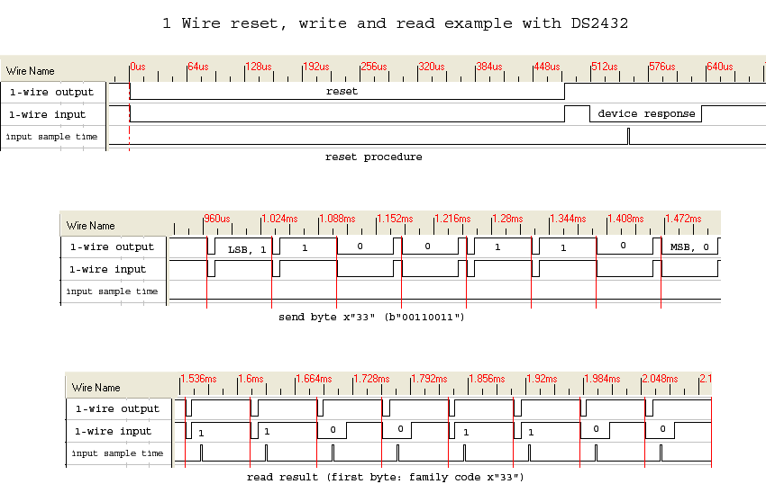
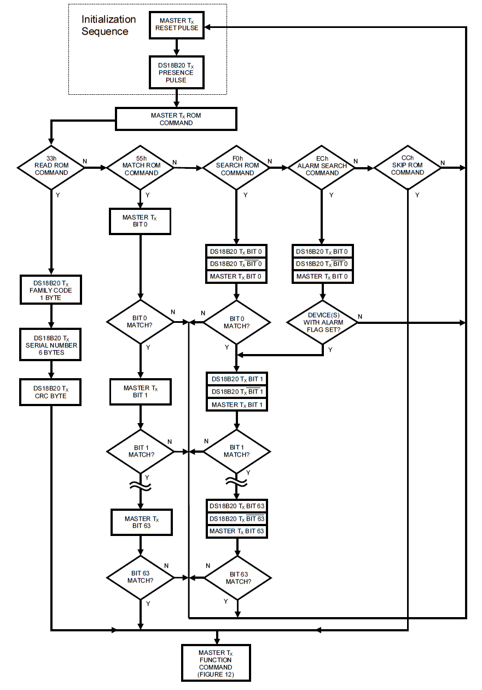
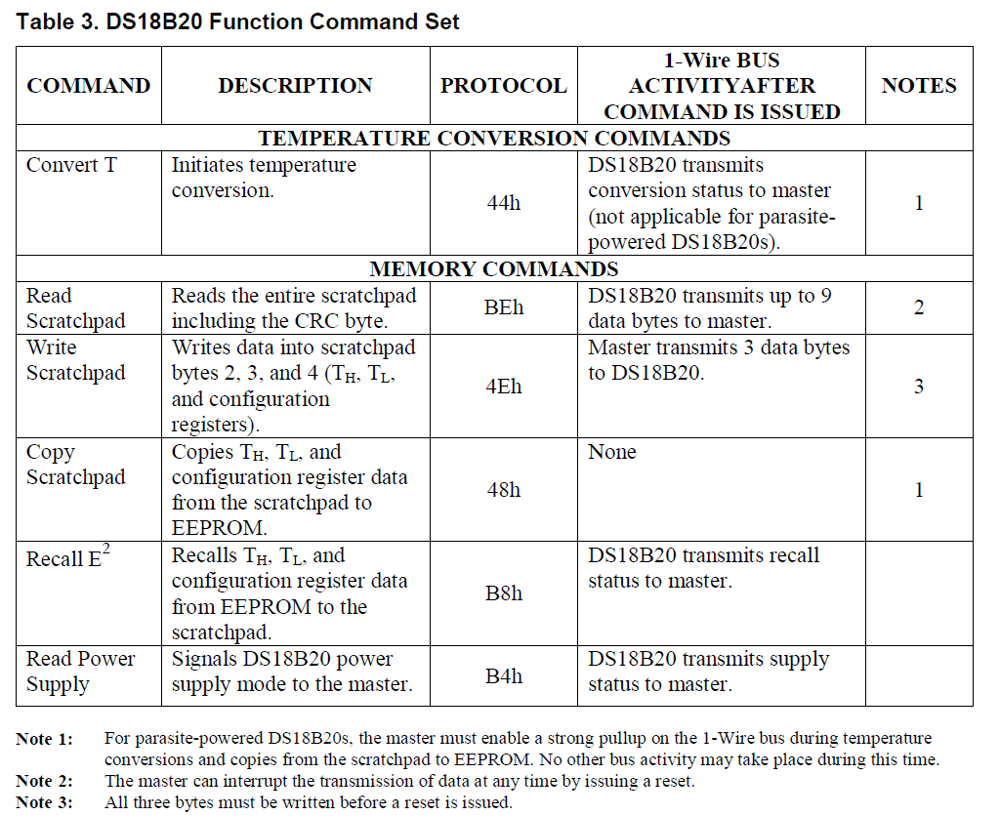
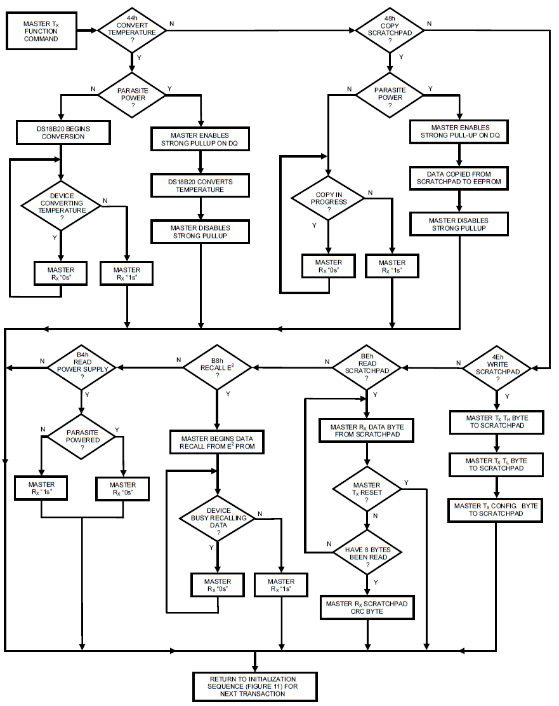

# 单总线协议1wire

1-ware单总线是Dallas的一项专有技术 [1].

## 硬件电路

## 脉冲时序

脉冲格式主要分3种 [2]：

1. reset脉冲
2. 发送
3. 接收

如下图[2]：

## 指令序列

一个完整的功能指令：

1. 初始化指令
2. ROM指令
3. 功能指令

### 初始化

基于单总线上的所有传输过程都是以初始化开始的，初始化过程由主机发出的复位脉冲和从机响应的应答脉冲组成。应答脉冲使主机知道，总线上有从机设备，且准备就绪。复位和应答脉冲的时间详见单总线信号部分。

### ROM命令

指令列举：

1. 搜索ROM  [F0h]
2. 读取ROM [33h]
   该命令仅适用于总线上只有一个从机设备。它允许主机直接读出从机的64位 ROM 代码，无须执行搜索 ROM 过程。如果该命令用于多节点系统，则必然发生数据冲突，因为每个从机设备都会响应该命令。
3. 匹配 ROM [55h]
   匹配 ROM 命令跟随64位 ROM 代码，从而允许主机访问多节点系统中某个指定的从机设备。仅当从机完全匹配64位 ROM 代码时，才会响应主机随后发出的功能命令；其它设备将处于等待复位脉冲状态。
4. 跳越 ROM [CCh]
   主机能够采用该命令同时访问总线上的所有从机设备，而无须发出任何 ROM 代码信息。该指令若是针对多节点设备应当只发送执行指令，而不是查询指令，查询指令，会导致返回数据冲突。
5. 报警搜索 [ECh]
   除那些设置了报警标志的从机响应外，该命令的工作方式完全等同于搜索 ROM 命令。

以DS18B20为例，ROM指令序列如下：

### 功能命令

以DS18B20为例，指令表如下：

以DS18B20为例，功能指令序列如下：

## 参考及引用

[1] 单总线协议（1-wire）. 知乎. <https://zhuanlan.zhihu.com/p/223031548>
[2] 1-Wire. wikipedia. <https://en.wikipedia.org/wiki/1-Wire>
[3] DS18B20 Programmable Resolution 1-Wire Digital Thermometer datasheet.
