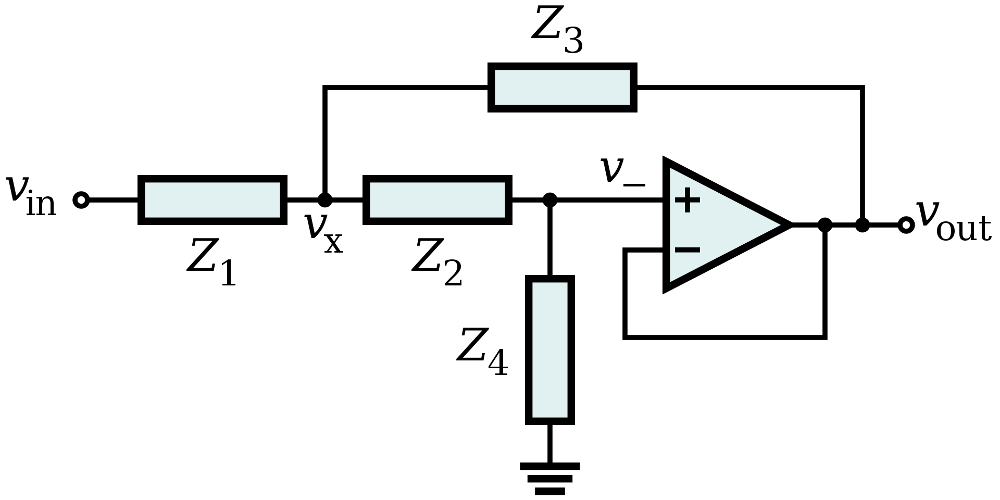

# Sallen-Key滤波器

Sallen-Key 滤波器是一种比较简单的二阶滤波器拓扑，是一种压控电压源 voltage-controlled voltage-source (VCVS) 滤波器拓扑的退化形式[1]。

类型拓扑见下图，它使用单个运放达到2阶滤波器的效果。

公式推导:

Sallen-Key 低通滤波器普通形式电路图：

Sallen-Key 高通滤波器普通形式电路图：

VCVS 带通滤波器普通形式电路图：

## 参考及引用

[1] Sallen–Key topology. Wikipedia. <https://en.wikipedia.org/wiki/Sallen%E2%80%93Key_topology>
