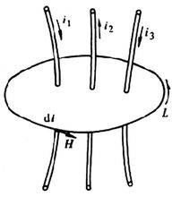
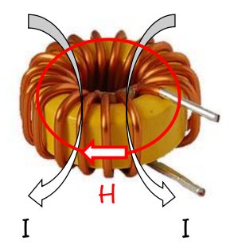
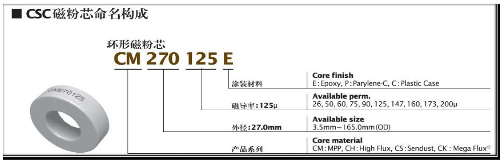

# 电感系数和磁芯磁导率的关系

刘佳业  
2020年11月07日

---

## 一、安培环路定理

根据安培环路定理，电场强度$$H$$满足公式如下：

$$
\begin{aligned}
\oint H \cdot d l = I
\end{aligned} \tag{1.0}
$$

或者表达为电磁感应强度，根据$$B = \mu H$$，有：

$$
\begin{align}
\oint B \cdot d l=\mu I
\end{align}\tag{1.1}
$$

其中：

- $$\mu$$为介质的磁导率。

模型举例，如下图：

该模型中，有安培环路定理公式如下：

$$
\begin{aligned}
\oint \vec{H} \cdot d l=-I_{1}+I_{2}-I_{3}
\end{aligned} \tag{1.2}
$$

注意，公式中，$$I_{1}$$, $$I_{2}$$, $$I_{3}$$是有方向差异的。  

## 二、磁环电感系数计算

环状电感（磁环电感），结构如下图：

与公式1.2同理，磁环中，沿着磁环的磁芯环状方向有：

$$
\begin{aligned}
\oint \vec{H} \cdot d l &=I_{1}+I_{2}+I_{3}+...I_{N}\\
&=N*I
\end{aligned} \tag{2.0}
$$

也就是：

$$
\begin{aligned}
\oint \vec{B} \cdot d l &=\mu \cdot N \cdot I
\end{aligned} \tag{2.1}
$$

其中：

- $$I_{1}, I_{2}, I_{3}...I_{N}$$为绕组中每匝绕线的电流，全部相等，设定为$$I$$；
- $$N$$为磁环的绕线匝数

我们根据上面的磁环，若是做一个电感，匝数为$$N$$，那么当电感绕线中电流为$$I$$时，实际通过磁环中间的电流为$$N \cdot I$$，且若是假设磁芯各处磁通密度一致，为$$B$$，公式2.1可以积分得到:

$$
\begin{align}
B \cdot l_{path}=\mu \cdot N \cdot I
\end{align}\tag{2.2}
$$

上式变形，得到磁通密度：

$$
\begin{align}
B = \frac{\mu \cdot N \cdot I}{l_{path}}
\end{align}\tag{2.3}
$$

磁通量为：

$$
\begin{align}
\Phi_B &= A_e \cdot B\\
& = \frac{\mu \cdot A_e \cdot N \cdot I}{l_{path}}
\end{align}\tag{2.4}
$$

根据法拉第电磁感应定律，感生电动势E为(记得需要乘以N匝)：

$$
\begin{align}
E &= N \cdot \frac{d \Phi_B }{d t} \\
&=\frac{\mu \cdot N^2 \cdot A_e }{l_{path}} \frac{ d I}{d t}
\end{align}\tag{2.5}
$$

根据电感量的定义：

$$
\begin{align}
L = V  \frac{d t}{d I}
\end{align}\tag{2.6}
$$

假设电感中线圈电阻为0ohm，那么就始终有$$E  = V $$，将公式2.5代入2.6 中，得到：

$$
\begin{align}
L = \frac{\mu \cdot N^2 \cdot A_e }{l_{path}}
\end{align}\tag{2.7}
$$

所以，**电感感量和匝数$$N$$的二次方成正比**，与$$A_e$$成正比，与磁导率$$\mu$$成正比，与磁路长度$$l_{path}$$成反比。

从电感系数的定义，得到：

$$
\begin{align}
A_l & = \frac{L}{N^2}\\
& = \frac{\mu \cdot A_e }{l_{path}}
\end{align}\tag{2.8}
$$

所以，根据安培环路定理和法拉第电磁感应定律，可以从磁芯的结构($$A_e$$和$$l_{path}$$)和磁芯材料磁导率($$\mu$$)，计算出磁芯的电感系数，进而根据匝数计算电感量。

### 举例

- 磁芯：CS270060；匝数：$$N = 105Ts$$；感量：$$L = 826uH±10\% $$

查规格书知道，标称值(额定)的$$A_l=75nH/N^2$$，而根据上面实际电感测试的电感量，反推计算如下：

$$
\begin{align}
A_{l-tested} = \frac{L}{N^2} = 74.92 nH/N^2 \approx 75 nH/N^2
\end{align}\tag{2.9}
$$

结果是一致的，接下来，我们直接使用磁芯的结构和磁芯材料的磁导率，计算电感系数$$A_l$$的大小，看看是否与标称值一致。

从网上随便找一个磁芯规格如[东莞南波源电子科技有限公司](http://www.selmag.com.cn/)，看他们CSC对应的规格书得到相关说明及参数。

参数：

- 磁环内径：$$ID_{min} = 14.73mm$$;
- 外径：$$OD_{max} = 26.92mm$$;
- 高度：$$HD_{max} = 11.18mm$$;
- 有效横截面积：$$A_e = 0.654 cm^2$$;
- 有效磁路长度：$$l_{path} = 6.35cm$$;
- 磁导率：$$\mu = 60 \cdot \mu_0 = 60 \cdot 4π×10^{−7} V·s/(A·m) = 7.53982×10^{-5} H/m$$

将CS270060磁芯的相关参数带入公式2.8，得到：

$$
\begin{align}
A_l &= \frac{ 7.53982×10^{-5} H/m \cdot 6.54 * 10^{-5}m^2}{6.35×10^{-2}m}\\
&= 77.65 nH/N^2
\end{align} \tag{2.10}
$$

与实际标定的$$A_l=75nH/N^2$$ 相差为：

$$
\begin{align}
\delta &= \frac{77.65 nH/N^2 - 75nH/N^2}{75nH/N^2} \cdot 100\% \\
&= 3.53 \%
\end{align}\tag{2.11}
$$

误差基本上可以忽略不计，也就是，电感系数的理论计算结果，与实际测试结果一致。

## 三、有磁芯气隙的电感

一般不是磁环的磁芯，都是做成几个磁芯合在一起成一套磁芯来使用，比如EE，EF，EI，UU系列，合在一起时，中间会有一点点间隙，也就是气隙。  
下图是EE磁芯的示意图，他由两个对称的E型磁芯拼凑成一副，拼凑时，中间难以完全贴合，是有些许气隙的，甚至有时候会出现杂质将气隙垫宽的现象，需要留意：

结合公式2.0：$$\oint \vec{H} \cdot d l = N \cdot I$$，在磁芯中加入磁芯气隙$$\Delta l$$，那么有：

$$
\begin{align}
\int_0^{l - \Delta l} H_{core} \cdot dl + \int_0^{\Delta l} H_{air} \cdot dl  = N \cdot I
\end{align}\tag{3.0}
$$

其中:

- $$H_{core}$$代表磁芯中的磁场强度
- $$H_{air}$$代表气隙中的磁场强度
- 气隙长度为$$\Delta l $$ ，且$$\Delta l \ll l $$
- $$l - \Delta l$$代表加入气隙后，磁芯部分的有效磁路长度$$l_{path}$$
  1. 当在EE磁芯的中间接触面磨损磁芯长度，达到增加气隙$$\Delta l$$的目的，$$l_{path} = l - \Delta l$$
  2. 当在EE磁芯的接触面垫高达到增加气隙$$\Delta l$$的目的（磁芯长度不变），$$l_{path} = l$$，也就是保持不变
  3. 公式2.1使用的$$l_{path} = l - \Delta l$$，代表第一种，磨气隙的方案

因为$$\Delta l \ll l $$，气隙极小，假设磁感应强度$$B$$（磁场线密度）未发生较大变化，仍按照原方向达到气隙的另一端，也就是$$A_{e-air}=A_{e-core}=A_e$$，那么应该有：$$B_{core}=B_{air}=B$$，则上面的公式可以变形为：

$$
\begin{align}
\int_0^{l - \Delta l} \frac{B}{\mu_{r-core}} \cdot dl + \int_0^{\Delta l} \frac{B}{\mu_{r-air}} \cdot dl  =\mu_0 \cdot N \cdot I
\end{align}\tag{3.1}
$$

其中

- 空气相对磁导率:  $$\mu_{r-air}=1$$;

即：

$$
\begin{align}
B \cdot (l-\Delta l ) + u_{r-core} \cdot B \cdot \Delta l = u_{r-core} \cdot \mu_0 \cdot N \cdot I
\end{align}\tag{3.2}
$$

也就是：

$$
\begin{align}
B = \frac{u_{r-core} \cdot \mu_0 \cdot N \cdot I}{l + (u_{r-core}-1) \cdot \Delta l}
\end{align}\tag{3.3}
$$

同理有磁通量：

$$
\begin{align}
\Phi_B &= A_e \cdot B\\
& = \frac{u_{r-core} \cdot \mu_0 \cdot A_e \cdot N \cdot I}{l + (u_{r-core}-1) \cdot \Delta l}
\end{align}\tag{3.4}
$$

根据法拉第电磁感应定律，有：

$$
\begin{align}
E &= N \cdot \frac{d \Phi_B }{d t} \\
&= \frac{u_{r-core}\mu_0 \cdot A_e \cdot N^2 }{l + (u_{r-core}-1) \cdot \Delta l}\frac{d I}{d t}
\end{align}\tag{3.5}
$$

结合公式(2.6)：$$L = V  \frac{d t}{d I}$$以及$$ E =V $$得到：

$$
\begin{align}
L = \frac{u_{r-core} \cdot \mu_0 \cdot A_e \cdot N^2 }{l + (u_{r-core}-1) \cdot \Delta l}
\end{align}\tag{3.6}
$$

与公式（2.7）：$$L = \frac{\mu \cdot N^2 \cdot A_e }{l_{path}}$$对比，可以看出，有效磁路长度从与原来的$$l$$变为了$$l + (u_{r-core}-1)\Delta l $$。

因此，有电感系数：

$$
\begin{align}
A_l = \frac{u_{r-core}\mu_0 \cdot A_e }{l + (u_{r-core}-1) \cdot \Delta l}
\end{align}\tag{3.7}
$$

求导（$$A_l$$对$$\Delta l$$求导）

$$
\begin{aligned}
A_l' &= u_{r-core}\mu_0 \cdot A_e \cdot \{-[l + (u_{r-core}-1) \cdot \Delta l]^{-2}\} \cdot (u_{r-core}-1)\\
&=-\frac{u_{r-core}\mu_0 \cdot (u_{r-core}-1) \cdot A_e}{[l + (u_{r-core}-1) \cdot \Delta l]^{2}}
\end{aligned}\tag{3.8}
$$

从公式3.6可以看出，若是$$u_{r-core}=2300$$（PC40材质的相对磁导率约等于2300），那么，只要磁芯气隙的长度有原来有效磁路长度的1/(2300-1)，就足以将原来的电感量降低一半。

从公式3.8可以看出，当气隙$$\Delta l$$接近于0时，$$A_l$$对$$\Delta l$$的导数绝对值很大，$$A_l$$随$$\Delta l$$的增加而快速下降。也就是当一副磁芯需要几个磁芯来拼凑的时候，若是不人工加入固定气隙，保持$$\Delta l$$在0附近，可能会导致电感量$$l$$的公差极大，因为实际拼凑磁芯时，气隙长度最好不要是0（感量不敏感的应用场景除外）。

疑问：关于示波器电流探头

- 看起来电流探头使用的是霍尔检测的原理，同时，有一个开口的磁环（磁环分为两半，需要测量时，将导线套在磁环中间，而不是穿线过去），使用时，需要两边磁环闭合，这样就会存在气隙；
- 气隙影响感量的问题如何解决：
  - 探头的磁芯接触面看起来像是玻璃介质的，非常光滑，很明显可以降低空气气隙$$\Delta l$$。
  - 若接触面真的是加了玻璃的，玻璃本身的相对磁导率就小，与空气一样，约等于1，因此玻璃介质可以看成是公式3.6、公式3.7中的气隙$$\Delta l$$的一部分，也就是增加$$\Delta l$$，降低了$$A_l$$，同时也降低了$$A_l$$对$$\Delta l$$的导数$$A_l'$$，也就是降低空气气隙的影响。

## 结论

所以，根据安培环路定律以及法拉第电磁感应定律，以及磁芯相对磁导率和磁芯结构（包括有效磁路长度和磁芯气隙），就可以推导出磁芯的电感量如公式2.7和公式3.6，电感系数如公式2.8和公式3.7。
