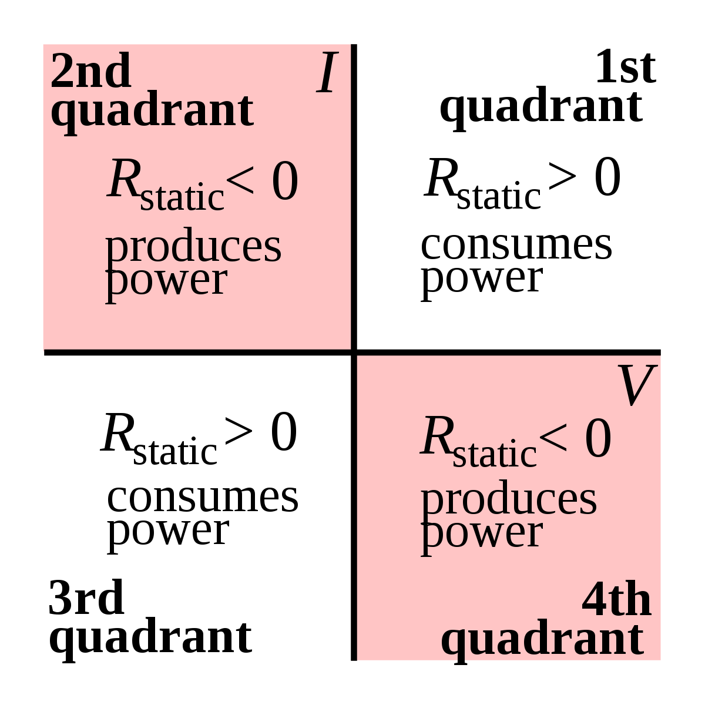
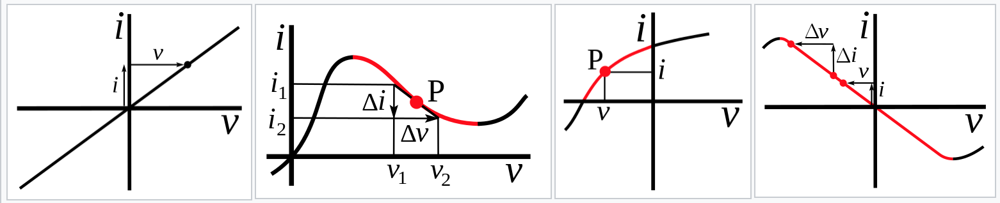
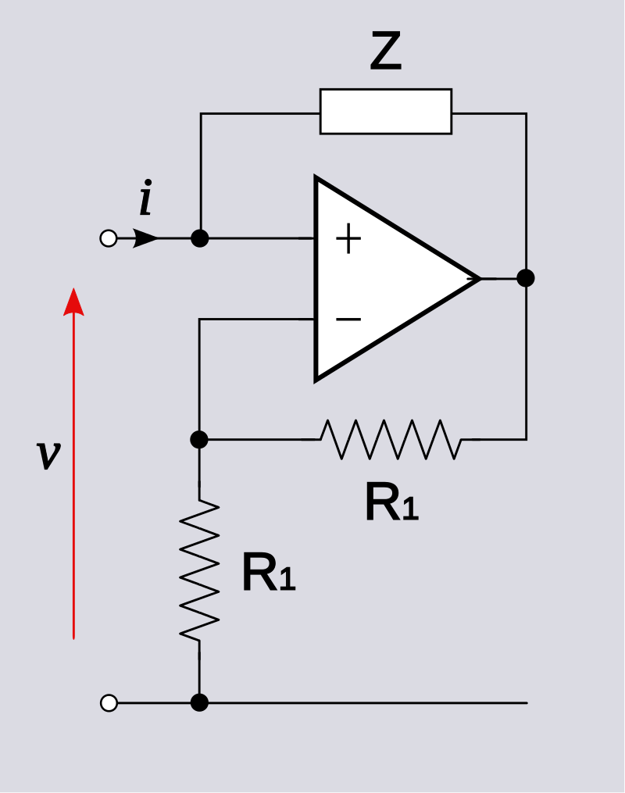
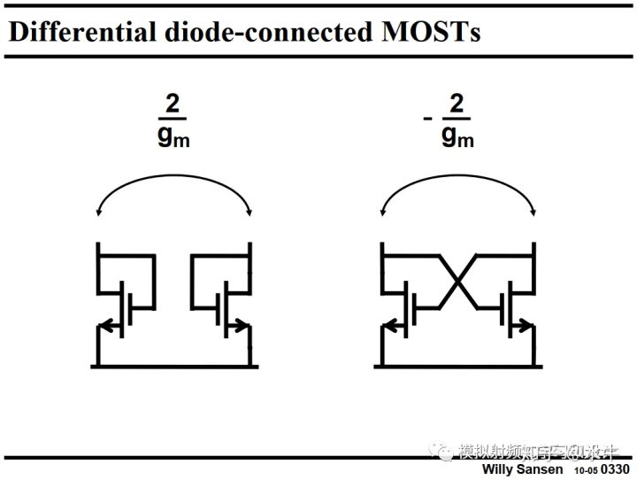
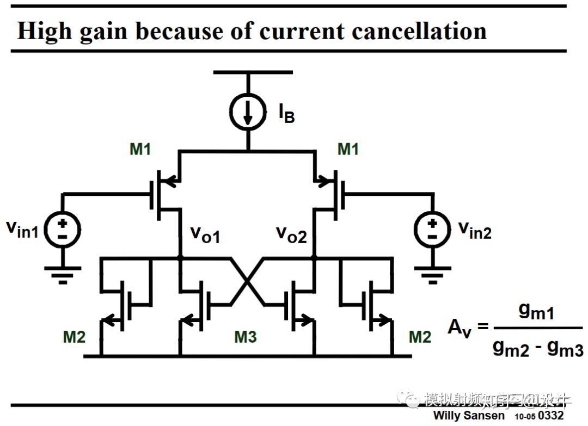
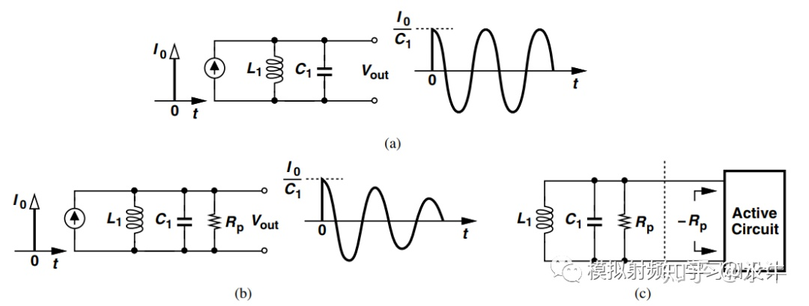
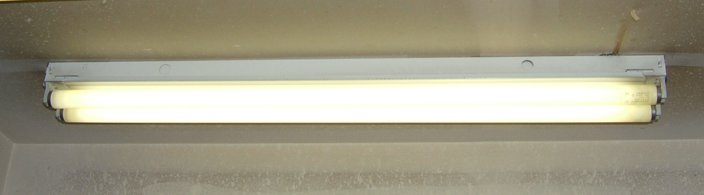

# 负阻

什么是负阻特性？  
negative resistance (NR)是指一些电路或电子元件在某特定埠的输入电流增加时，电压反而减少的特性，或者反过来说，输入电压越大，输入电流越小。与一般的电阻特性正好相反。

I-V坐标（电流以输入电流方向为正）：

图中，1、3象限描述的是被动（无源）器件的阻抗范围，工作在该区域是，器件消耗功率；2、4象限的是有源器件，工作在该区域是，器件对外做功。

**但是，负阻抗不一定要在全范围内都是负阻抗，也不一定落在2、4象限。在2、4象限的也不一定都是负阻抗**，如下图四条曲线分别解释了：a）电阻（线性）；b）微分负阻（在一个区域内呈现负阻）；c）电源（带有内阻，且非线性）；d）线性负阻（或者说“有源电阻”，不但是微分负阻，也是静态负阻，It has negative differential resistance and negative static resistance (is active)）。

所以，很多器件都具有负阻特性，但因为没有能量源，其工作I-V曲线没有进入2、4象限，也因此只能在一定范围内实现负阻抗特性。

## 负阻器件

有些器件的I-V关系图中都有一个区域，其微分电阻为负值（$$\frac{dV}{dI}$$为负值），也就是在该区域呈现负阻特性。如耿氏二极管具有典型的IV曲线如下图：

这意味着耿氏二极管具有负阻（Negative resistance）效应，或称负微分电阻（Negative differential resistance）

常见呈现负阻特性的器件有：

- 单结晶体管 (Unijunction Transistor, 简称 UJT )，这种器件现已经基本废弃不用了；
- 一些真空管；
- 耿氏二极管（英语：Gunn diode，香港作耿氏二极体，台湾作甘恩二极体、刚氏二极体），或称转移电子器件（transferred electron device, TED）
- 隧道二极

## 负阻电路

如下图，就是一个简单的负阻电路：

运放的$$V_{out}$$满足:

$$
{V_{out} = V_{in}(\frac{R_1+R_1}{R_1})}
$$

输入电流等于：

$$
\begin{align}
I_{in} &= (V_{in}-V_{out})/Z \\
&= (V_{in}-V_{in}(\frac{R_1+R_1}{R_1}))/Z \\
&= -V_{in}(\frac{R_1+R_1}{R_1}-1)/Z
\end{align}
$$

很明显，当输入电压为正，输入电流为负，也就是电流反向输出。而且，输入电流越大，输出电流也越大，有负阻特性。并且，可以通过调节两个反馈电阻的比例（这里两个反馈分压电阻都标注成了R1，若是改成R和R2会更直观些），调节输出电压，或者调节阻抗Z，达到调节电流大小的目的。

这个电路是线性的，有源的，而且，总是做负功（跟电源一样，输出能量），工作在I-V曲线的2，4象限。

很多种接法电路中有负阻特性，如下图所示的交叉mos管接法在实际电路中使用更为经常，看进去的阻抗大小为$$-2/g_m$$：

以及其他的负阻抗电路：

还有振荡器设计：

另外，还有混沌电路中需要用到负阻抗（要作为非线性源）。

## 负阻带来的问题

负阻让我想起二极管的温度正反馈问题：二极管的导通压降具有负温度系数，当几个二极管并联，若是存在二极管温度不一致，那么，温度高的二极管，因为其正向导通压降更低，而承担更大的电流（二极管是并联的，因此他们的端电压一致），电流更大会导致更多的发热量，因此可能会陷入正反馈。

在维基百科中，有关于日光灯的举例：

翻译就是：日光灯在导通时，有负阻特性，因此，会出现电流越大，压降越小，那就很容易陷入正反馈，导致失效，解决办法就是加入一个镇流器（ballast，其实是个电感），用于限制AC电流。

**那我以前对镇流器的理解就错了，我一直以为镇流器只知道为了开机用，不知道其他的。**

下面是维基百科的原文：  
Fluorescent lamp, a device with negative differential resistance. In operation, an increase in current through the fluorescent tube causes a drop in voltage across it. If the tube were connected directly to the power line, the falling tube voltage would cause more and more current to flow, causing it to arc flash and destroy itself. To prevent this, fluorescent tubes are connected to the power line through a ballast. The ballast adds positive impedance (AC resistance) to the circuit to counteract the negative resistance of the tube, limiting the current.

正面例子是：MOS的雪崩（avalanche），MOS的雪崩能维持电压平台，不但电流增加时能维持，而且，还有正温度系数，所以，MOS管一般都有一定的雪崩能力。

疑问：

1. 为什么一般的二极管不标称雪崩能力，是否因为有正反馈机制导致失效，所以不允许雪崩？
2. 隧道二极管有哪些用处，是否跟其负阻特性有关？
3. 负阻是否可以在电路中用作补偿?
4. 如何做一个非线性的负阻？
   - 将Z调整成非线性的，应该就可以，但用什么办法调节能达到我的需求呢？
5. 直觉告诉我，负阻应该会很有用处，但问题来了，什么用处？
6. 耿氏二极管说用于振荡器，隧道二极管也说用于振荡器，负阻电路也说用于振荡器，具体为何振荡器需要使用负阻？

参考：

1. 维基百科-负阻特性：<https://zh.wikipedia.org/wiki/%E8%B2%A0%E9%98%BB%E7%89%B9%E6%80%A7>
2. wikipedia-Negative resistance：<https://en.wikipedia.org/wiki/Negative_resistance>
3. 知乎-负阻概念和应用<https://zhuanlan.zhihu.com/p/113357662>